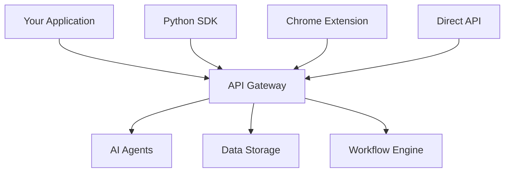

# Development Overview

Build applications and integrations with the Naas Universal Data & AI Platform.

## Quick Start

The fastest way to start building with Naas:

1. **Get API Access**: [Sign up](https://naas.ai) for a free account
2. **Generate API Key**: Dashboard → Settings → API Keys  
3. **Choose Integration Method**:
   - [API Gateway](/development/api-integration/api-gateway) - Direct REST API
   - [Python SDK](/development/client-sdks/python) - `pip install naas`
   - [Chrome Extension](/development/client-sdks/chrome-extension) - Browser integration

## Platform Architecture



## Core Capabilities

### AI Agent Development
- **Create custom agents** with specialized knowledge
- **Chain multiple agents** for complex workflows
- **Integrate external tools** and data sources

### Data Integration
- **Upload datasets** via API or SDK
- **Query data** with natural language
- **Real-time processing** with webhooks

### Workflow Automation
- **Schedule tasks** with cron expressions
- **Trigger workflows** from external events
- **Chain AI operations** with data processing

## Integration Paths

### For Developers
- **[API Gateway](/development/api-integration/api-gateway)**: REST endpoints for any language
- **[ABI API](/development/api-integration/abi-api)**: Direct AI engine integration
- **[Python SDK](/development/client-sdks/python)**: Full-featured Python library
- **Rate limits**: 1,000 requests/month (free), unlimited (pro)

### For End Users
- **[Chrome Extension](/development/client-sdks/chrome-extension)**: AI assistance on any website
- **Web Platform**: [naas.ai](https://naas.ai) - No coding required

### For Enterprises
- **Custom deployment** options available
- **SLA guarantees** and dedicated support
- **Volume pricing** for high-traffic applications

## Example: Build a Data Analysis Agent

```python
import naas

# 1. Initialize client
client = naas.Client(api_key="your_key")

# 2. Create specialized agent
analyst = client.agents.create(
    name="Sales Analyst",
    prompt="Analyze sales data and provide actionable insights"
)

# 3. Upload data
dataset = client.data.upload("sales_q4.csv")

# 4. Get AI insights
insights = analyst.analyze(dataset, 
    "What are the top 3 growth opportunities?")

print(insights.content)
```

## Getting Help

- **[Community Discord](https://discord.gg/naas)**: Connect with other developers
- **[GitHub Discussions](https://github.com/jupyter-naas/abi/discussions)**: Technical questions
- **[Support Email](mailto:support@naas.ai)**: Direct assistance

Start building with the [API Gateway](/development/api-integration/api-gateway) or install the [Python SDK](/development/client-sdks/python) to get started immediately.
