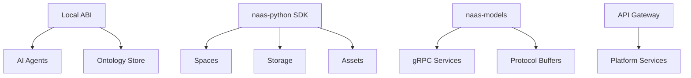

# Scale Overview

Scale your Naas deployment with infrastructure tools, SDKs, and platform services.

## Scaling Tools

Based on the actual Naas repositories:

1. **[naas-python SDK](/development/client-sdks/python)**: Infrastructure management (`pip install naas-python`)
2. **[naas-models](/development/client-sdks/models)**: Protocol definitions for service communication
3. **[Infrastructure APIs](/development/api-integration/api-gateway)**: Platform services and gateways
4. **[ABI API](/development/api-integration/abi-api)**: Local AI agent orchestration

## Infrastructure Architecture



## Scaling Capabilities

### Infrastructure Management
- **Space Operations**: Manage cloud environments with naas-python
- **Storage Systems**: Handle data lakes and asset storage  
- **Asset Management**: Deploy and version application resources

### Service Communication
- **Protocol Buffers**: Type-safe service definitions via naas-models
- **gRPC Integration**: Multi-language service communication
- **API Gateways**: Centralized service routing and management

### AI Orchestration
- **Local ABI**: Multi-agent AI workflows with ontology integration
- **Model Management**: Support for ChatGPT, Claude, Gemini, Grok, Llama, Mistral
- **Workflow Automation**: Complex business process orchestration

## Scaling Paths

### Infrastructure Teams
- **[naas-python SDK](/development/client-sdks/python)**: Manage spaces, storage, and assets
- **[naas-models](/development/client-sdks/models)**: Protocol definitions for service integration
- **[Infrastructure APIs](/development/api-integration/api-gateway)**: Platform service gateways

### AI Teams  
- **[ABI API](/development/api-integration/abi-api)**: Local multi-agent AI orchestration
- **Multi-model support**: ChatGPT, Claude, Gemini, Grok, Llama, Mistral, DeepSeek
- **Ontology management**: BFO-compliant semantic data handling

### Platform Teams
- **Protocol Buffer integration**: Type-safe service communication
- **gRPC services**: Multi-language platform integration
- **Hexagonal architecture**: Clean infrastructure patterns

## Example: Scale Infrastructure

```python
import naas_python as naas

# 1. Manage cloud spaces
naas.space.add(space_name="production")

# 2. Create storage systems
naas.storage.create(
    workspace_id="prod-123",
    storage_name="data-lake"
)

# 3. Deploy application assets
naas.asset.create(
    workspace_id="prod-123", 
    asset_creation=deployment_config
)
```

## Repository Links

- **[jupyter-naas/naas-python](https://github.com/jupyter-naas/naas-python)**: Infrastructure SDK
- **[jupyter-naas/naas-models](https://github.com/jupyter-naas/naas-models)**: Protocol definitions  
- **[jupyter-naas/abi](https://github.com/jupyter-naas/abi)**: AI orchestration system

## Getting Help

- **[GitHub Discussions](https://github.com/jupyter-naas/abi/discussions)**: Technical questions
- **[Support Email](mailto:support@naas.ai)**: Infrastructure assistance

Start scaling with the [naas-python SDK](/development/client-sdks/python) or [ABI API](/development/api-integration/abi-api) for AI orchestration.
