# Introduction

**AI Networks as a Service: The Universal Data & AI Platform**

Welcome to Naas - the platform for building, deploying, and scaling your own AI Networks. Whether you're a business user working with AI assistants or a developer building intelligent systems, Naas provides the AI Operating System and interface you need.

## What is Naas?

Naas is an AI Networks as a Service platform that combines:

🌐 **AI Workspace** - Browser interface for working with your AI Networks  
🤖 **ABI (AI Operating System)** - Build your own AI using ontologies as the unifying field  
🔗 **Integration Ecosystem** - Connect with your existing tools and data  
📈 **Marketplace** - Share and monetize AI solutions  

## Platform Overview

```mermaid
%%{init: {'theme':'base', 'themeVariables': {'primaryColor': '#f8fafc', 'primaryTextColor': '#1e293b', 'primaryBorderColor': '#e2e8f0', 'lineColor': '#64748b'}}}%%
graph TB
    subgraph "User Experience"
        WEB["🌐 AI Workspace<br/>(Browser-based)"]
        EXT["🔧 Chrome Extension<br/>(Any website)"]
        CLI["💻 ABI (Local CLI)<br/>(Local development)"]
    end
    
    subgraph "Platform Services"
        API["⚡ API Gateway<br/>(naas-api-ce)"]
        WORKSPACE["🏢 Workspace Backend<br/>(React app)"]
        CREDITS["💳 Usage Management<br/>(credits-api)"]
    end
    
    subgraph "AI Engine"
        AGENTS["🤖 AI Agents<br/>(ABI Core)"]
        ONTOLOGY["🧠 Knowledge Graph<br/>(Ontology Engine)"]
        MODELS["🎯 Multi-Model Support<br/>(OpenAI, Claude, etc.)"]
    end
    
    WEB --> API
    EXT --> API
    CLI --> AGENTS
    CLI --> API
    
    API --> WORKSPACE
    API --> CREDITS
    API --> AGENTS
    
    AGENTS --> ONTOLOGY
    AGENTS --> MODELS
    
    classDef userExp fill:#e8f5e8,stroke:#4caf50,stroke-width:2px,color:#2e7d32
    classDef platform fill:#e3f2fd,stroke:#2196f3,stroke-width:1px,color:#1565c0
    classDef aiEngine fill:#fff3e0,stroke:#ff9800,stroke-width:2px,color:#e65100
    
    class WEB,EXT,CLI userExp
    class API,WORKSPACE,CREDITS platform
    class AGENTS,ONTOLOGY,MODELS aiEngine
```

## Your Journey

### 🌟 **Start with the Platform**
Experience the power of AI + ontologies in naas.ai with your personalized assistant:
- **Create your AIA** - Personal AI Assistant from your LinkedIn profile
- **Ontology-powered intelligence** - Your professional data becomes structured knowledge
- **@AIA in chat** - Natural conversation with your personalized assistant
- **Custom AI Assistants** - Combine the best AI models with your custom ontologies

### 🛠️ **Customize with ABI**
When you need more control, use ABI for custom development:
- **Local CLI development** - Build custom agents
- **Open source** - Full control over your AI
- **Extensible framework** - Connect any service

### 🚀 **Scale your AI System**
Integrate deeply with platform APIs and services:
- **API integration** - Connect your systems
- **Custom deployments** - Enterprise scaling
- **Marketplace publishing** - Share your solutions

## Key Capabilities

### For Business Users
- **Personal AI Assistant (AIA)** created from your LinkedIn profile
- **Custom AI Assistants** using ontology manager and visual editor
- **Browser-based workspace** for collaboration
- **Chrome extension** for AI assistance anywhere

### For Developers  
- **ABI CLI** for local development and customization
- **Python SDK** for programmatic access
- **RESTful APIs** for system integration
- **Open source core** for full control

### For Organizations
- **Enterprise deployment** options
- **Usage-based billing** with cost controls
- **Security and compliance** features
- **Professional support** and training

## What's Next?

Ready to get started? Choose your path:

  

    

      

        <h3>🌐 Try the Platform</h3>
      

      

        
Start immediately with our cloud platform

        <a className="button button--primary" href="https://naas.ai" target="_blank" style={{margin: 0, textAlign: 'center'}}>
          Platform Quickstart
        </a>
      

    

  

  

    

      

        <h3>💻 Customize with ABI</h3>
      

      

        
Install ABI locally for development and customization.

        <a className="button button--secondary" href="https://github.com/jupyter-naas/abi" target="_blank" style={{margin: 0, textAlign: 'center'}}>
          Install ABI CLI
        </a>
      

    

  

### Learn the Architecture
- [System Architecture](/get-started/system-architecture) - Understand how everything connects
- [Scale Overview](/scale/overview) - Platform scaling and architecture
- [API Integration](/scale/api-integration/api-gateway) - Connect your systems

### Get Support
- **Help & Support**: [support@naas.ai](mailto:support@naas.ai)
- **Community**: [Slack](https://naas-club.slack.com)
- **Platform Access**: [naas.ai](https://naas.ai)
