# Introduction

**Universal Data & AI Platform**

Welcome to Naas - the complete platform for building, deploying, and scaling AI-powered business solutions. Whether you're a business user looking to leverage AI or a developer building custom solutions, Naas provides the tools and infrastructure you need.

## What is Naas?

Naas is a comprehensive AI platform that combines:

🌐 **Cloud Platform** - Ready-to-use AI workspace and collaboration tools  
🤖 **ABI (Local CLI)** - Customizable AI development framework  
🔗 **Integration Ecosystem** - Connect with your existing tools and data  
📈 **Marketplace** - Share and monetize AI solutions  

## Platform Overview

```mermaid
%%{init: {'theme':'base', 'themeVariables': {'primaryColor': '#f8fafc', 'primaryTextColor': '#1e293b', 'primaryBorderColor': '#e2e8f0', 'lineColor': '#64748b'}}}%%
graph TB
    subgraph "User Experience"
        WEB["🌐 Naas Workspace<br/>(Browser-based)"]
        EXT["🔧 Chrome Extension<br/>(Any website)"]
        CLI["💻 ABI CLI<br/>(Local development)"]
    end
    
    subgraph "Platform Services"
        API["⚡ API Gateway<br/>(naas-api-ce)"]
        WORKSPACE["🏢 Workspace Backend<br/>(React app)"]
        CREDITS["💳 Usage Management<br/>(credits-api)"]
    end
    
    subgraph "AI Engine"
        AGENTS["🤖 180+ AI Agents<br/>(ABI Core)"]
        ONTOLOGY["🧠 Knowledge Graph<br/>(Ontology Engine)"]
        MODELS["🎯 Multi-Model Support<br/>(OpenAI, Claude, etc.)"]
    end
    
    WEB --> API
    EXT --> API
    CLI --> AGENTS
    CLI --> API
    
    API --> WORKSPACE
    API --> CREDITS
    API --> AGENTS
    
    AGENTS --> ONTOLOGY
    AGENTS --> MODELS
    
    classDef userExp fill:#e8f5e8,stroke:#4caf50,stroke-width:2px,color:#2e7d32
    classDef platform fill:#e3f2fd,stroke:#2196f3,stroke-width:1px,color:#1565c0
    classDef aiEngine fill:#fff3e0,stroke:#ff9800,stroke-width:2px,color:#e65100
    
    class WEB,EXT,CLI userExp
    class API,WORKSPACE,CREDITS platform
    class AGENTS,ONTOLOGY,MODELS aiEngine
```

## Your Journey

### 🌟 **Start with the Platform**
Most users begin with our cloud platform for immediate productivity:
- **No setup required** - Start in your browser
- **Collaborative workspace** - Work with your team
- **180+ AI agents** - Ready for business tasks

### 🛠️ **Customize with ABI**
When you need more control, use ABI for custom development:
- **Local CLI development** - Build custom agents
- **Open source** - Full control over your AI
- **Extensible framework** - Connect any service

### 🚀 **Scale with Development**
Integrate deeply with platform APIs and services:
- **API integration** - Connect your systems
- **Custom deployments** - Enterprise scaling
- **Marketplace publishing** - Share your solutions

## Key Capabilities

### For Business Users
- **Ready-to-use AI agents** for common business tasks
- **Browser-based workspace** for collaboration
- **Chrome extension** for AI assistance anywhere
- **Template marketplace** for quick starts

### For Developers  
- **ABI CLI** for local development and customization
- **Python SDK** for programmatic access
- **RESTful APIs** for system integration
- **Open source core** for full control

### For Organizations
- **Enterprise deployment** options
- **Usage-based billing** with cost controls
- **Security and compliance** features
- **Professional support** and training

## What's Next?

Ready to get started? Choose your path:

  

    

      

        <h3>🌐 Try the Platform</h3>
      

      

        
Start immediately with our cloud platform - no setup required.

        <a className="button button--primary" href="/get-started/quickstart">
          Platform Quickstart
        </a>
      

    

  

  

    

      

        <h3>💻 Customize with ABI</h3>
      

      

        
Install ABI locally for development and customization.

        <a className="button button--secondary" href="/customize/installation">
          Install ABI CLI
        </a>
      

    

  

### Learn the Architecture
- [System Architecture](/get-started/system-architecture) - Understand how everything connects
- [Platform Services](/development/platform-services) - Deep dive into each component
- [Integration Patterns](/development/integration-patterns) - Connect your systems

### Get Support
- **Help & Support**: [support@naas.ai](mailto:support@naas.ai)
- **Community**: [Discord](https://discord.gg/naas)
- **Platform Access**: [naas.ai](https://naas.ai)
