# System Architecture

Understanding the complete Naas platform architecture and how all components work together.

## High-Level Architecture

The Naas platform is built as a distributed system with clear separation between user interfaces, platform services, and the AI engine core.

```mermaid
%%{init: {'theme':'base', 'themeVariables': {'primaryColor': '#f8fafc', 'primaryTextColor': '#1e293b', 'primaryBorderColor': '#e2e8f0', 'lineColor': '#64748b'}}}%%
graph TB
    subgraph "User Interfaces"
        WEB["🌐 Naas Workspace<br/>(React Web App)"]
        EXT["🔧 Chrome Extension<br/>(Browser Integration)"]
        CLI["💻 ABI CLI<br/>(Local Development)"]
        SDK["🐍 Python SDK<br/>(Programmatic Access)"]
    end
    
    subgraph "Platform Services"
        API["⚡ API Gateway<br/>(naas-api-ce)<br/>FastAPI + Auth"]
        CREDITS["💳 Credits API<br/>(Usage Management)<br/>Billing & Limits"]
    end
    
    subgraph "AI Engine (ABI Core)"
        AGENTS["🤖 Multi-Agent System<br/>(180+ Specialized Agents)"]
        ONTOLOGY["🧠 Ontology Engine<br/>(Knowledge Graph + SPARQL)"]
        INTEGRATIONS["🔗 Integration Framework<br/>(External APIs)"]
        STORAGE["💾 Storage Systems<br/>(Triple/Vector/Object)"]
    end
    
    subgraph "External Integrations"
        LLM["🎯 LLM Providers<br/>(OpenAI, Claude, Gemini)"]
        DATA["📊 Data Sources<br/>(APIs, Databases, Files)"]
        TOOLS["🛠️ External Tools<br/>(Slack, Notion, etc.)"]
    end
    
    WEB --> API
    EXT --> API
    CLI --> AGENTS
    CLI --> API
    SDK --> API
    
    API --> CREDITS
    API --> AGENTS
    
    AGENTS --> ONTOLOGY
    AGENTS --> INTEGRATIONS
    AGENTS --> STORAGE
    INTEGRATIONS --> LLM
    INTEGRATIONS --> DATA
    INTEGRATIONS --> TOOLS
    
    classDef userInterface fill:#e8f5e8,stroke:#4caf50,stroke-width:2px,color:#2e7d32
    classDef platform fill:#e3f2fd,stroke:#2196f3,stroke-width:2px,color:#1565c0
    classDef aiEngine fill:#fff3e0,stroke:#ff9800,stroke-width:2px,color:#e65100
    classDef external fill:#f3e5f5,stroke:#9c27b0,stroke-width:1px,color:#6a1b9a
    
    class WEB,EXT,CLI,SDK userInterface
    class API,CREDITS platform
    class AGENTS,ONTOLOGY,INTEGRATIONS,STORAGE aiEngine
    class LLM,DATA,TOOLS external
```



## Component Details

### User Interfaces

#### 🌐 Workspace (React Web App)
- **Repository**: [jupyter-naas/workspace](https://github.com/jupyter-naas/workspace)
- **Purpose**: Main user interface for AI interactions
- **Technology**: React, TypeScript, modern web standards
- **Features**:
  - Conversational AI interface
  - Team collaboration tools
  - File upload and processing
  - Analytics dashboard
  - Template marketplace

#### 🔧 Chrome Extension
- **Repository**: [jupyter-naas/chrome-extension](https://github.com/jupyter-naas/chrome-extension)
- **Purpose**: Bring AI assistance to any website
- **Features**:
  - Context-aware content analysis
  - Universal AI assistant overlay
  - Seamless authentication
  - Cross-site functionality

#### 💻 ABI CLI (Local Development)
- **Repository**: [jupyter-naas/abi](https://github.com/jupyter-naas/abi)
- **Purpose**: Local development and customization framework
- **Technology**: Python, Docker, modern development tools
- **Key Benefits**:
  - Complete offline capability
  - Full customization control
  - Open source transparency
  - Local data processing

#### 🐍 Python SDK
- **Repository**: [jupyter-naas/naas-python](https://github.com/jupyter-naas/naas-python)
- **Purpose**: Programmatic platform access
- **Features**:
  - REST API client
  - CLI tools
  - Authentication management
  - Local development utilities

### Platform Services

#### ⚡ API Gateway (naas-api-ce)
- **Repository**: [jupyter-naas/naas-api-ce](https://github.com/jupyter-naas/naas-api-ce)
- **Technology**: FastAPI, PostgreSQL, Redis
- **Architecture**: Domain-driven design with microservices
- **Features**:
  - JWT-based authentication
  - Rate limiting and quotas
  - Request/response logging
  - API versioning
  - OpenAPI documentation

**Core Domains**:
- **Auth Domain**: User authentication and authorization
- **Space Domain**: Computational environment management
- **Registry Domain**: Container and module management
- **Analytics Domain**: Usage tracking and insights

#### 💳 Credits API (Usage Management)
- **Repository**: [jupyter-naas/credits-api](https://github.com/jupyter-naas/credits-api)
- **Purpose**: Billing, usage tracking, and resource management
- **Features**:
  - Usage-based billing
  - Real-time cost tracking
  - Budget controls and alerts
  - Granular usage analytics

### AI Engine (ABI Core)

#### 🤖 Multi-Agent System
The heart of the platform - 180+ specialized AI agents:

**Agent Categories**:
- **Business Functions**: Sales, Marketing, Finance, Operations
- **Technical**: Development, DevOps, Data Analysis
- **Domain-Specific**: Healthcare, Legal, Education
- **Universal**: General-purpose conversational AI

**Agent Architecture**:
```python
# Example agent structure
class BusinessAgent(Agent):
    def __init__(self):
        self.tools = [
            SalesforceIntegration(),
            GoogleSheetsConnector(),
            EmailSender()
        ]
        self.ontology_queries = [
            "get_customer_data",
            "analyze_sales_pipeline"
        ]
```

#### 🧠 Ontology Engine
- **Technology**: RDF/OWL ontologies with SPARQL queries
- **Purpose**: Knowledge representation and reasoning
- **Features**:
  - BFO-compliant ontology structure
  - Deterministic SPARQL queries
  - Semantic relationship modeling
  - Event-driven knowledge updates

#### 🔗 Integration Framework
- **Purpose**: Connect to external systems and data sources
- **Supported Integrations**:
  - **APIs**: REST, GraphQL, SOAP
  - **Databases**: PostgreSQL, MySQL, MongoDB
  - **Cloud Services**: AWS, GCP, Azure
  - **Business Tools**: Salesforce, HubSpot, Slack
  - **File Systems**: Local, S3, Google Drive

#### 💾 Storage Systems
- **Triple Store**: Oxigraph for RDF knowledge graphs
- **Vector Store**: Semantic search and embeddings
- **Object Storage**: Unstructured data management
- **Cache Layer**: Redis for performance optimization

### External Integrations

#### 🎯 LLM Providers
Multi-model support for flexibility and cost optimization:
- **OpenAI**: GPT-4, GPT-3.5-turbo
- **Anthropic**: Claude 3.5 Sonnet
- **Google**: Gemini Pro
- **Meta**: Llama models
- **Mistral**: Mistral Large
- **Local**: Ollama support for on-premises deployment

#### 📊 Data Sources
Connect to virtually any data source:
- **Business Systems**: CRM, ERP, HR systems
- **Cloud Storage**: S3, Google Drive, Dropbox
- **Databases**: SQL and NoSQL databases
- **APIs**: Third-party service APIs
- **Files**: CSV, JSON, PDF, Office documents

## Data Flow Architecture

### Request Processing Flow


### Data Processing Pipeline

1. **Input Processing**: Parse and validate user input
2. **Context Enrichment**: Query ontology for relevant context
3. **Agent Selection**: Route to appropriate specialized agent
4. **Tool Execution**: Run integrations and external API calls
5. **AI Generation**: Generate response using selected LLM
6. **Output Formatting**: Structure response for user interface
7. **Knowledge Update**: Store new facts in knowledge graph

## Deployment Architectures

### 1. Cloud-First (Recommended)
- All platform services managed by Naas
- ABI can run locally for customization
- Best for: Most users, fastest time-to-value

### 2. Hybrid Deployment
- Platform services in cloud
- ABI and sensitive data on-premises
- Best for: Regulated industries, data sovereignty

### 3. Fully Self-Hosted
- All components on your infrastructure
- Complete control and customization
- Best for: Maximum security, custom requirements

### 4. Development Setup
```bash
# Local development environment
git clone https://github.com/jupyter-naas/abi.git
git clone https://github.com/jupyter-naas/naas-api-ce.git
git clone https://github.com/jupyter-naas/workspace.git

# Start core services
cd abi && make chat-abi-agent
cd naas-api-ce && docker-compose up
cd workspace && npm start
```

## Security Architecture

### Authentication & Authorization
- **JWT tokens** for stateless authentication
- **Role-based access control** (RBAC)
- **OAuth integration** with major providers
- **API key management** for programmatic access

### Data Protection
- **Encryption at rest** for all stored data
- **TLS encryption** for all network communication
- **Private cloud** deployment options
- **Data residency** controls for compliance

### Privacy Controls
- **Local processing** options with ABI CLI
- **Data retention** policies and controls
- **Audit logging** for compliance requirements
- **GDPR compliance** features

## Scalability & Performance

### Horizontal Scaling
- **Microservices architecture** enables independent scaling
- **Container orchestration** with Kubernetes
- **Load balancing** across multiple instances
- **Database sharding** for high-volume workloads

### Performance Optimization
- **Caching layers** at multiple levels
- **Async processing** for long-running tasks
- **Connection pooling** for database efficiency
- **CDN delivery** for static assets

### Monitoring & Observability
- **Real-time metrics** and alerting
- **Distributed tracing** across services
- **Performance profiling** and optimization
- **Usage analytics** and insights

This architecture provides the foundation for understanding how to customize, integrate, and scale the Naas platform according to your specific needs.

## Next Steps

- **Start Customizing**: [Install ABI CLI](/customize/installation) for local development
- **Integrate Systems**: [Development guides](/scale/platform-services) for API integration
- **Scale Up**: Contact us for enterprise deployment planning
