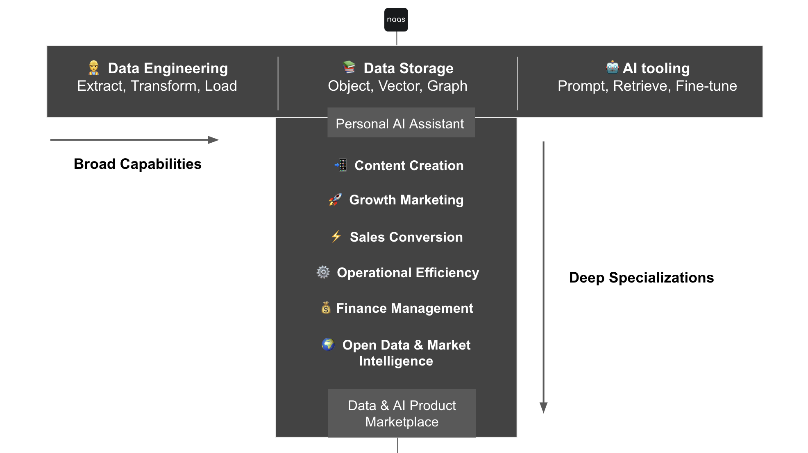

# Key Features
---

The NAAS platform is built around the concept of workspaces, which are central to the user experience, providing a personalized or collaborative environment for accessing and utilizing the platform's extensive features. Each user has a personal workspace for individual projects and can also participate in team workspaces for collaborative efforts. These workspaces are fully customizable, allowing users to tailor their environment to their specific brand identity, strategic and operational needs, with billing aggregated at the workspace level for convenience and transparency.

## Horizontal Capabilities

**AIA (Personal AI Assistant):** AIA is your digital twin, designed to reflect your worldview, writing styles, and preferences. As a trusted advisor, AIA accesses tools and specific actions, connecting to ABI for analytics and workflow automation. It simplifies navigating tasks and analysis, providing personalized guidance. AIA ensures the platform's technology is tailored to your strategic and operational needs, making it an integral part of your decision-making process.

**Chat (Integration Hub):** Chat acts as the central communication hub, facilitating direct interactions with multiple foundational AI models (such as GPT, Llama, Claude, Midjourney, Stability AI), AIA, ABI, and specialized agents. This feature streamlines real-time communication, task management, and problem-solving, making it easier for users to achieve their operational goals. 

**Search (Knowledge Base):** This feature enables users to easily navigate public or private resources. It empowers users to quickly find the information needed to optimize their use of AIA, ABI, and the specialized agents, enhancing efficiency and productivity:
- Public Mode: enables access to a broad array of public documentation, templates, and resources. This open-access layer enables users to leverage shared knowledge, best practices, and community-driven insights empowering them to fully utilize the platform's capabilities.
- Private Mode: enables access to private resources, which include data, analyses, or documents generated or used by ABI and the specialized agents. This private layer ensures secure, user-specific access to sensitive or proprietary information, allowing for personalized and confidential data management and analysis.
  
**Lab (Development Environment):**Lab offers an advanced environment for users to innovate, customize, and develop new agents or various data products like dashboards, alerting systems, and APIs, tailored to their unique business needs. It supports both public and private development efforts, enabling the creation of tailored solutions that meet specific business needs. Lab empowers users with the tools and flexibility needed to develop bespoke solutions that precisely address their business challenges.

Additional features such as Secrets Management, Connections to Third-Party APIs, Orchestration Layer (including Scheduler, Pipeline, Webhook, Asset Generation, Notifications, and Serverless Deployment), Credits Based System, Graph Database, Object Storage, Vector Engine, Monitoring, and the Chrome Extension for chat, are all accessible and manageable within personal and team workspaces. This integrated approach ensures that every tool and feature of the NAAS platform is available to enhance your workspace's functionality, supporting both individual productivity and team collaboration.

By centralizing the platform's capabilities within customizable workspaces and implementing workspace-level billing, the NAAS platform ensures users can efficiently manage their resources, streamline their workflows, and optimize their operational and strategic initiatives.

## Vertical Solutions

**ABI (Artificial Business Intelligence System):** ABI serves as central intelligence of your everyday business, orchestrating analytics and insights. Customizable and open-source, it powers data analysis for smart decision-making. ABI coordinates with specialized agents, ensuring a unified approach to business analytics.
- Content Assistant: Enhances social selling and content strategy across multiple platforms.
- Growth Marketing Assistant: Identifies and enriches marketing qualified leads through content analysis.
- Sales Assistant: Prioritizes and refines sales opportunities, integrating closely with CRM systems.
- Ops Assistant: Streamlines operations with automated task management and operational alignment.
- Finance Assistant: Manages financial transactions and supports accurate financial planning and analysis.
- Open Data Assistant: Provides real-time external data for enriched business intelligence and strategic adaptation.

**Marketplace:** Acts as a shopping mall within the NAAS platform, offering users access to a wide array of public or private services, tools, and applications. It enables the seamless integration of external solutions into the platform's ecosystem, enhancing the capabilities of ABI and the specialized agents. By facilitating the discovery and utilization of additional resources, the Marketplace empowers users to customize and extend their analytics, content strategies, and operational processes further, fostering innovation and driving more effective business solutions.The Marketplace is distinguished by its two modes:
- Public Mode: Accessible to the entire NAAS user community, Public Mode in the Marketplace opens the door to a vast selection of external solutions that can be integrated effortlessly into the NAAS ecosystem. This inclusive environment allows users to discover and adopt vetted third-party offerings, enhancing the platform's capabilities and fostering a culture of innovation and expanded operational functionality.
- Private Mode: Designed for organizations requiring tailored solutions or seeking to maintain confidentiality, Private Mode in the Marketplace provides a secure venue for accessing exclusive or custom services, tools, and applications. This mode ensures that businesses can leverage specialized and proprietary solutions in a controlled and secure environment, aligning closely with specific operational needs and data privacy consideration