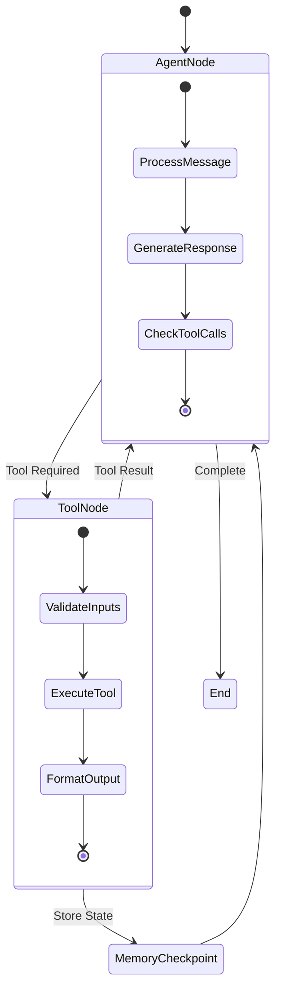

# Multi-Agent Systems Architecture

Naas implements a sophisticated multi-agent architecture based on LangGraph, enabling complex AI workflows that combine reasoning, tool usage, and collaborative problem-solving. This technical deep-dive explores the architecture, implementation patterns, and scaling considerations.

## Core Architecture

### LangGraph Foundation

Naas agents are built on LangGraph, a framework for creating stateful, multi-step applications with Large Language Models:

```python
from langchain_openai import ChatOpenAI
from abi.services.agent.Agent import Agent, AgentConfiguration, AgentSharedState, MemorySaver

# Core agent creation pattern
def create_agent(agent_shared_state=None, agent_configuration=None) -> Agent:
    # Configure LLM model
    model = ChatOpenAI(model="gpt-4o", temperature=0)
    
    # Initialize tools and agents
    tools = []
    agents = []
    
    # Set configuration and state
    if agent_configuration is None:
        agent_configuration = AgentConfiguration(system_prompt=SYSTEM_PROMPT)
    if agent_shared_state is None:
        agent_shared_state = AgentSharedState(thread_id=0)
    
    return BusinessAgent(
        name="Business Agent",
        chat_model=model,
        tools=tools,
        agents=agents,
        state=agent_shared_state,
        configuration=agent_configuration,
        memory=MemorySaver()
    )
```

### State Management

The agent system uses a sophisticated state machine that manages the flow between model reasoning and tool execution:



### Agent Categories

Naas provides multiple categories of agents, each optimized for specific domains:

#### Core System Agents
- **ABI Agent**: Meta-agent for intelligent routing across models
- **Model-Specific Agents**: ChatGPT, Claude, Gemini, Grok, Llama, Mistral, DeepSeek

#### Business Function Agents
- **Sales Agent**: CRM integration, pipeline analysis, lead scoring
- **Marketing Agent**: Campaign optimization, content generation, analytics
- **Finance Agent**: Financial modeling, reporting, compliance
- **Operations Agent**: Process optimization, resource allocation

#### Technical Agents
- **Development Agent**: Code generation, testing, deployment
- **DevOps Agent**: Infrastructure management, monitoring, optimization
- **Data Analysis Agent**: Statistical analysis, visualization, insights

## Tool Integration Architecture

### Tool Definition Pattern

Tools in Naas follow a standardized pattern that makes them accessible to LLM agents:

```python
from langchain_core.tools import StructuredTool
from pydantic import BaseModel, Field

class DatabaseQuerySchema(BaseModel):
    query: str = Field(..., description="SQL query to execute")
    database: str = Field(..., description="Database connection name")

def query_database(query: str, database: str) -> str:
    """Execute SQL query and return results."""
    # Implementation details
    return result

# Expose as LangChain tool
database_tool = StructuredTool(
    name="query_database",
    description="Execute SQL queries against configured databases",
    func=query_database,
    args_schema=DatabaseQuerySchema
)
```

### Integration Categories

#### Data Integration Tools
- **Database connectors**: SQL, NoSQL, graph databases
- **API clients**: REST, GraphQL, external service integration
- **File processors**: Excel, CSV, PDF, document parsing
- **Cloud storage**: S3, GCS, Azure Blob, object storage

#### Analysis Tools
- **Statistical analysis**: Pandas, NumPy, SciPy integration
- **Visualization**: Plotly, Matplotlib, interactive charts
- **Machine learning**: Scikit-learn, TensorFlow, PyTorch models
- **Business intelligence**: Dashboard generation, KPI calculation

#### Communication Tools
- **Notifications**: Email, Slack, Teams, webhook delivery
- **Report generation**: PDF, HTML, automated document creation
- **Collaboration**: Shared workspace, comment systems
- **External APIs**: Third-party service integration

## Memory and Context Management

### Conversation Persistence

The MemorySaver component provides persistent conversation history:

```python
from abi.services.agent.Agent import MemorySaver

# Memory configuration
memory = MemorySaver()

# Conversation context maintained across interactions
agent = BusinessAgent(
    name="Persistent Agent",
    chat_model=model,
    tools=tools,
    memory=memory
)

# Context available in subsequent interactions
response = agent.chat("What did we discuss about sales targets?")
```

### Ontology Integration

Agents can query and reason over the ontology knowledge graph:

```python
from rdflib import Graph, URIRef, Literal
from abi.services.triple_store import TripleStoreService

def ontology_query_tool(sparql_query: str) -> str:
    """Query the ontology knowledge graph."""
    triple_store = TripleStoreService()
    results = triple_store.query(sparql_query)
    return format_results(results)

# Agent can reason over structured knowledge
sparql_tool = StructuredTool(
    name="query_ontology",
    description="Query the knowledge graph using SPARQL",
    func=ontology_query_tool,
    args_schema=SPARQLQuerySchema
)
```

## Agent Composition Patterns

### Hierarchical Delegation

Complex tasks can be decomposed using agent hierarchies:

```python
class OrchestratorAgent(Agent):
    def __init__(self):
        # Initialize with sub-agents as tools
        super().__init__(
            name="Orchestrator",
            tools=[],
            agents=[
                data_analysis_agent,
                visualization_agent,
                reporting_agent
            ]
        )
    
    def complex_workflow(self, requirements):
        # Delegate to specialized agents
        data = self.call_agent("data_analysis", requirements.data_query)
        charts = self.call_agent("visualization", data)
        report = self.call_agent("reporting", {"data": data, "charts": charts})
        return report
```

### Parallel Processing

For independent tasks, agents can work in parallel:

```python
import asyncio
from concurrent.futures import ThreadPoolExecutor

async def parallel_analysis(data_sources):
    tasks = []
    for source in data_sources:
        agent = create_analysis_agent()
        task = asyncio.create_task(agent.analyze(source))
        tasks.append(task)
    
    results = await asyncio.gather(*tasks)
    return aggregate_results(results)
```

### Consensus and Validation

Multiple agents can provide validation and consensus:

```python
class ConsensusAgent(Agent):
    def __init__(self, validator_agents):
        self.validators = validator_agents
        super().__init__(name="Consensus", tools=[], agents=validator_agents)
    
    def validate_decision(self, proposal):
        votes = []
        for validator in self.validators:
            vote = validator.evaluate(proposal)
            votes.append(vote)
        
        consensus = calculate_consensus(votes)
        return consensus
```

## Scaling Considerations

### Horizontal Scaling

Agent workloads can be distributed across multiple instances:

```python
# Agent pool configuration
class AgentPool:
    def __init__(self, agent_factory, pool_size=10):
        self.agents = [agent_factory() for _ in range(pool_size)]
        self.current = 0
    
    def get_agent(self):
        agent = self.agents[self.current]
        self.current = (self.current + 1) % len(self.agents)
        return agent
    
    async def process_request(self, request):
        agent = self.get_agent()
        return await agent.process_async(request)
```

### Resource Management

Tools and agents can be configured with resource limits:

```python
from dataclasses import dataclass

@dataclass
class ResourceLimits:
    max_tokens: int = 4000
    timeout_seconds: int = 30
    memory_limit_mb: int = 512
    concurrent_requests: int = 5

# Agent with resource constraints
agent = BusinessAgent(
    name="Resource-Limited Agent",
    chat_model=model,
    tools=tools,
    resource_limits=ResourceLimits()
)
```

### Performance Monitoring

Comprehensive monitoring enables optimization:

```python
import time
from functools import wraps

def monitor_performance(func):
    @wraps(func)
    async def wrapper(*args, **kwargs):
        start_time = time.time()
        try:
            result = await func(*args, **kwargs)
            duration = time.time() - start_time
            log_success(func.__name__, duration)
            return result
        except Exception as e:
            duration = time.time() - start_time
            log_error(func.__name__, duration, e)
            raise
    return wrapper

# Apply monitoring to agent methods
@monitor_performance
async def agent_process(self, message):
    return await self.workflow.ainvoke(message)
```

## Security and Governance

### Access Control

Fine-grained access control for tools and agents:

```python
from enum import Enum

class Permission(Enum):
    READ_DATA = "read_data"
    WRITE_DATA = "write_data"
    EXTERNAL_API = "external_api"
    SENSITIVE_INFO = "sensitive_info"

class SecureAgent(Agent):
    def __init__(self, permissions: List[Permission]):
        self.permissions = permissions
        # Filter tools based on permissions
        allowed_tools = self.filter_tools_by_permission(all_tools, permissions)
        super().__init__(tools=allowed_tools)
    
    def validate_tool_access(self, tool_name):
        required_permission = TOOL_PERMISSIONS.get(tool_name)
        return required_permission in self.permissions
```

### Audit Logging

All agent actions are logged for compliance:

```python
import logging
from datetime import datetime

class AuditLogger:
    def log_agent_action(self, agent_name, action, inputs, outputs, user_id):
        audit_record = {
            "timestamp": datetime.utcnow().isoformat(),
            "agent": agent_name,
            "action": action,
            "user_id": user_id,
            "inputs_hash": hash_sensitive_data(inputs),
            "outputs_hash": hash_sensitive_data(outputs),
            "success": True
        }
        logging.info("AUDIT", extra=audit_record)
```

## Integration with Ontologies

### Semantic Reasoning

Agents can perform semantic reasoning over the knowledge graph:

```python
def semantic_query_tool(natural_language_query: str) -> str:
    """Convert natural language to SPARQL and execute."""
    # Use LLM to convert natural language to SPARQL
    sparql_query = llm_to_sparql(natural_language_query)
    
    # Execute against ontology
    results = triple_store.query(sparql_query)
    
    # Convert results back to natural language
    return format_for_llm(results)
```

### Knowledge Graph Updates

Agents can update the knowledge graph based on new information:

```python
def update_ontology_tool(entity: str, relation: str, value: str) -> str:
    """Update the knowledge graph with new information."""
    # Validate against ontology schema
    if validate_ontology_update(entity, relation, value):
        # Create RDF triple
        triple = create_rdf_triple(entity, relation, value)
        
        # Insert into knowledge graph
        triple_store.insert(triple)
        
        return f"Successfully updated {entity} {relation} {value}"
    else:
        return f"Invalid ontology update: {entity} {relation} {value}"
```

This multi-agent architecture enables Naas to handle complex, real-world AI workflows while maintaining scalability, security, and integration with enterprise systems.
