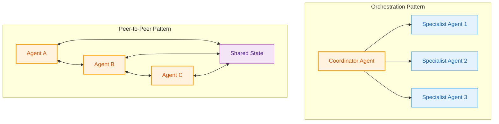
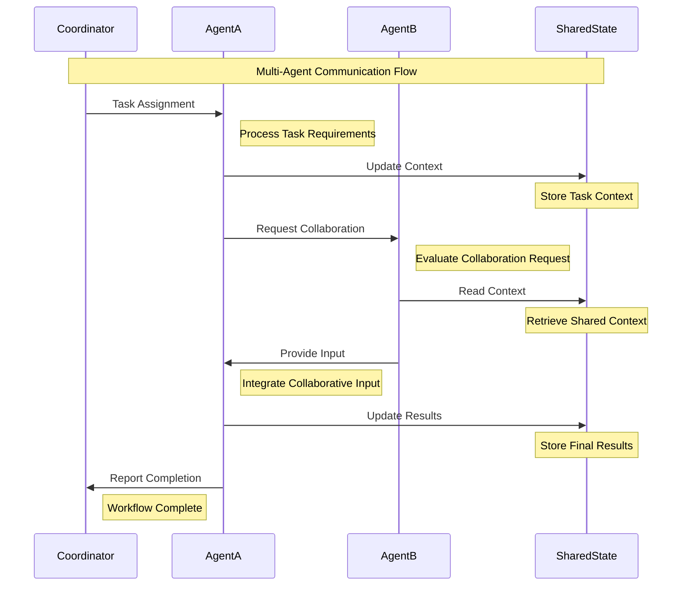

# Multi-Agent Systems

Naas implements sophisticated multi-agent systems that enable complex AI workflows through collaborative problem-solving, distributed reasoning, and coordinated tool usage. This section covers advanced patterns for building agent networks that scale from simple interactions to enterprise-grade orchestration.

## Agent Collaboration Patterns

Multi-agent systems in Naas follow established patterns that enable agents to work together effectively:



**Three core collaboration patterns:**
- **Orchestration**: Central coordinator delegates tasks to specialized agents
- **Peer-to-Peer**: Agents collaborate directly through shared state and communication
- **Pipeline**: Sequential processing with handoffs between specialized stages

## Hierarchical Delegation

Complex tasks decomposed using agent hierarchies:

```python
class OrchestratorAgent(Agent):
    """
    High-level agent that coordinates workflows by delegating 
    to specialized sub-agents.
    """
    
    def __init__(self):
        self.data_analyst = create_data_analysis_agent()
        self.visualization_agent = create_visualization_agent()
        self.reporting_agent = create_reporting_agent()
        
        super().__init__(
            name="Workflow Orchestrator",
            agents=[self.data_analyst, self.visualization_agent, self.reporting_agent]
        )
    
    async def execute_workflow(self, requirements):
        """Coordinate analytical workflow across agents."""
        
        # Step 1: Data Analysis
        analysis = await self.call_agent("data_analyst", {
            "data_sources": requirements["data_sources"],
            "analysis_type": requirements.get("analysis_type")
        })
        
        # Step 2: Visualization
        charts = await self.call_agent("visualization_agent", {
            "data": analysis["data"],
            "chart_types": requirements["visualizations"]
        })
        
        # Step 3: Report Generation
        report = await self.call_agent("reporting_agent", {
            "analysis": analysis["insights"],
            "visualizations": charts["charts"],
            "format": requirements["report_format"]
        })
        
        return {
            "status": "completed",
            "results": report,
            "agents_used": ["data_analyst", "visualization_agent", "reporting_agent"]
        }
```

## Parallel Processing

Independent tasks executed concurrently for improved performance:

```python
class ParallelAgentProcessor:
    """Manages parallel execution of multiple agents."""
    
    def __init__(self, max_concurrent: int = 5):
        self.max_concurrent = max_concurrent
        self.semaphore = asyncio.Semaphore(max_concurrent)
    
    async def process_parallel_tasks(self, tasks):
        """Execute multiple agent tasks concurrently."""
        
        async def execute_task(task):
            async with self.semaphore:
                agent = self.get_agent_instance(task["agent_name"])
                return await agent.process_async(task["inputs"])
        
        # Execute all tasks concurrently
        results = await asyncio.gather(
            *[execute_task(task) for task in tasks],
            return_exceptions=True
        )
        
        return self.process_results(tasks, results)

# Example: Business Intelligence Workflow
async def business_intelligence_analysis(data_requirements):
    processor = ParallelAgentProcessor()
    
    parallel_tasks = [
        {
            "agent_name": "sales_agent",
            "inputs": {"metrics": ["revenue", "conversion"], "period": "Q4"}
        },
        {
            "agent_name": "marketing_agent", 
            "inputs": {"metrics": ["cac", "ltv"], "campaigns": "all"}
        },
        {
            "agent_name": "finance_agent",
            "inputs": {"analysis": "profitability", "breakdown": ["product", "region"]}
        }
    ]
    
    return await processor.process_parallel_tasks(parallel_tasks)
```

## Consensus and Validation

Multiple agents provide validation for critical decisions:

```python
class ConsensusAgent(Agent):
    """Coordinates multiple agents to reach consensus."""
    
    def __init__(self, validator_agents, consensus_threshold=0.75):
        self.validators = validator_agents
        self.threshold = consensus_threshold
        super().__init__(name="Consensus Coordinator", agents=validator_agents)
    
    async def validate_decision(self, proposal):
        """Get consensus from multiple agents on a proposal."""
        
        # Submit to all validators
        validations = await asyncio.gather(*[
            self.get_validation(validator, proposal) 
            for validator in self.validators
        ])
        
        # Calculate consensus
        votes = [v["confidence"] for v in validations if "confidence" in v]
        avg_confidence = sum(votes) / len(votes) if votes else 0
        
        return {
            "consensus": avg_confidence >= self.threshold,
            "confidence": avg_confidence,
            "validator_responses": validations,
            "recommendation": self.generate_recommendation(avg_confidence)
        }
    
    async def get_validation(self, agent, proposal):
        """Get validation from single agent."""
        prompt = f"Evaluate this proposal and provide confidence (0-1): {proposal}"
        response = await agent.process_async(prompt)
        return self.parse_validation_response(response)
```

## Communication Protocols

Structured communication ensures reliable agent coordination:



**Communication methods:**
- **Message Passing**: Direct agent-to-agent communication
- **Shared State**: Common data structures for coordination
- **Event-Driven**: Reactive communication based on system events
- **Request-Response**: Synchronous interactions for immediate feedback

## Scaling Considerations

### Horizontal Scaling
Distribute agent workloads across multiple instances:

```python
class AgentPool:
    """Manages pool of agent instances for load distribution."""
    
    def __init__(self, agent_factory, pool_size=10):
        self.agents = [agent_factory() for _ in range(pool_size)]
        self.current = 0
    
    def get_agent(self):
        agent = self.agents[self.current]
        self.current = (self.current + 1) % len(self.agents)
        return agent
    
    async def process_request(self, request):
        agent = self.get_agent()
        return await agent.process_async(request)
```

### Performance Monitoring
Track multi-agent system performance:

```python
class MultiAgentMonitor:
    """Monitor performance across agent networks."""
    
    def __init__(self):
        self.metrics = {}
        self.coordination_overhead = 0
    
    def track_workflow(self, workflow_id, agents_used, execution_time):
        """Track multi-agent workflow performance."""
        self.metrics[workflow_id] = {
            "agents": agents_used,
            "duration": execution_time,
            "coordination_time": self.coordination_overhead,
            "efficiency": self.calculate_efficiency(agents_used, execution_time)
        }
    
    def get_performance_report(self):
        """Generate performance analysis."""
        return {
            "total_workflows": len(self.metrics),
            "avg_agents_per_workflow": self.avg_agents_used(),
            "avg_execution_time": self.avg_execution_time(),
            "coordination_overhead": self.avg_coordination_overhead(),
            "efficiency_trends": self.analyze_efficiency_trends()
        }
```

## Integration with Foundation

Multi-agent systems build on the LangGraph foundation covered in previous sections:

- **[Architecture Overview](./overview)**: Platform architecture and component relationships
- **[LangGraph Foundation](./langgraph-foundation)**: Core state management and workflow patterns
- **[Tool Integration](./tool-integration)**: How agents access external systems and data

This multi-agent architecture enables Naas to handle complex enterprise scenarios requiring coordination between multiple AI systems while maintaining reliability, scalability, and clear accountability.
