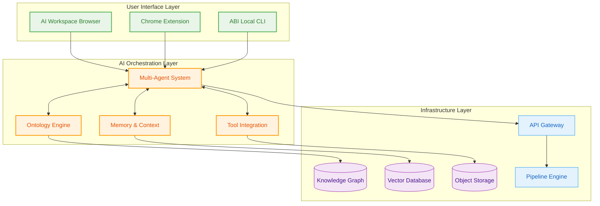
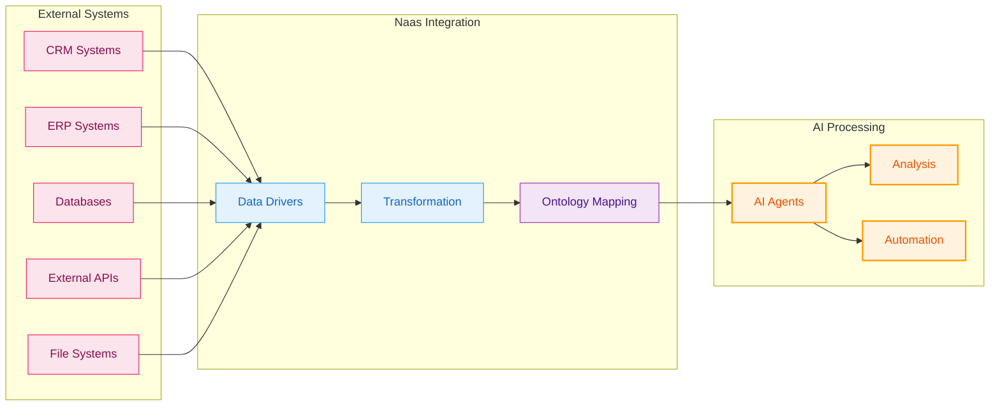

# Architecture Overview

Naas implements a sophisticated multi-agent architecture that enables complex AI workflows combining reasoning, tool usage, and collaborative problem-solving. The platform is built on proven open-source foundations while providing enterprise-grade scalability and security.

## Platform Architecture

The Naas platform consists of three interconnected layers that work together to provide comprehensive AI capabilities:

**The three-layer architecture enables:**

- **Separation of Concerns**: Each layer has distinct responsibilities while maintaining clean interfaces
- **Scalability**: Layers can be scaled independently based on demand
- **Flexibility**: Components can be swapped or extended without affecting other layers
- **Security**: Security controls can be applied at appropriate architectural boundaries

## Core Components

### Multi-Agent System
The heart of Naas's AI capabilities, built on LangGraph for stateful agent interactions. Agents can collaborate, delegate tasks, and maintain context across complex workflows.

### Ontology Engine  
Formal knowledge representation using W3C standards (RDF/OWL) that enables semantic reasoning and data integration. The ontology serves as the "unifying field" connecting data, models, and workflows.

### Memory & Context Management
Persistent conversation history and knowledge retention using vector databases and graph storage. Enables agents to maintain context across sessions and learn from interactions.

### Tool Integration Framework
Standardized patterns for connecting external systems, databases, APIs, and services. Tools are automatically exposed to agents through the LangGraph framework.

## Deployment Models

### Local Development
- **ABI CLI**: Complete AI operating system running locally
- **Jupyter Integration**: Native notebook environment for rapid prototyping  
- **Offline Capable**: Full functionality without cloud dependencies
- **Model Flexibility**: Support for local, cloud, or hybrid model deployment

### Cloud Infrastructure
- **Kubernetes Native**: Container orchestration for production scaling
- **Multi-Region**: Global deployment with data residency controls
- **Auto-Scaling**: Dynamic resource allocation based on workload
- **High Availability**: Built-in redundancy and failover capabilities

### Hybrid Architecture
- **Local + Cloud**: Combine local development with cloud infrastructure
- **Edge Computing**: Deploy agents closer to data sources
- **Air-Gapped**: Complete offline operation for maximum security
- **Federated**: Multi-organization deployments with shared ontologies

## Integration Patterns

### Data Integration
The platform supports multiple data integration patterns to connect with existing enterprise systems:

**Integration capabilities include:**
- **Universal Connectors**: Python-based drivers for any system with an API
- **Real-Time Processing**: Streaming data integration and event processing
- **Batch Processing**: Scheduled data synchronization and bulk operations
- **Semantic Mapping**: Automatic ontology alignment and data harmonization

## Security Architecture

### Defense in Depth
Multiple layers of security controls protect data and operations:

- **Network Security**: TLS encryption, VPN access, network segmentation
- **Authentication**: Multi-factor auth, SSO, certificate-based access
- **Authorization**: Role-based access control, principle of least privilege
- **Data Protection**: Encryption at rest and in transit, key management
- **Audit & Compliance**: Comprehensive logging, compliance reporting

### Zero Trust Model
The platform implements zero trust principles:

- **Verify Explicitly**: Every request is authenticated and authorized
- **Least Privilege**: Minimal access rights for users and services
- **Assume Breach**: Continuous monitoring and incident response

## Performance Characteristics

### Scalability Metrics
- **Agent Concurrency**: 1000+ concurrent agents per cluster
- **Request Throughput**: 10,000+ requests per second at API layer
- **Data Processing**: Petabyte-scale knowledge graph operations
- **Response Latency**: Sub-second agent response times

### Resource Optimization
- **Elastic Scaling**: Automatic scaling based on demand patterns
- **Resource Pooling**: Shared compute resources across agents
- **Caching Strategy**: Multi-level caching for frequently accessed data
- **Load Balancing**: Intelligent request distribution across nodes

## Technology Stack

### Core Technologies
- **LangGraph**: Agent orchestration and state management
- **LangChain**: LLM integration and tool framework
- **RDFLib**: Ontology processing and semantic reasoning
- **FastAPI**: High-performance API framework
- **PostgreSQL**: Transactional data storage
- **Redis**: Caching and session management

### AI/ML Stack
- **Multiple LLM Support**: OpenAI, Anthropic, Google, Meta, Mistral
- **Vector Databases**: Pinecone, Weaviate, Chroma for embeddings
- **Graph Databases**: Neo4j, Amazon Neptune for knowledge graphs
- **Model Serving**: Ollama, vLLM for local model deployment

### Infrastructure
- **Kubernetes**: Container orchestration and service mesh
- **Docker**: Containerization and deployment packaging
- **Helm**: Kubernetes application packaging and management
- **Prometheus/Grafana**: Monitoring and observability stack

## Next Steps

Explore specific architectural components:

- **[LangGraph Foundation](./langgraph-foundation)**: Deep dive into agent state management
- **[Tool Integration](./tool-integration)**: Patterns for connecting external systems  
- **[Memory Management](./memory-management)**: Context persistence and knowledge retention
- **[Security Architecture](./security-architecture)**: Comprehensive security model
- **[Performance Optimization](./performance-optimization)**: Scaling and optimization strategies

Each section provides detailed implementation guidance with code examples and best practices.
