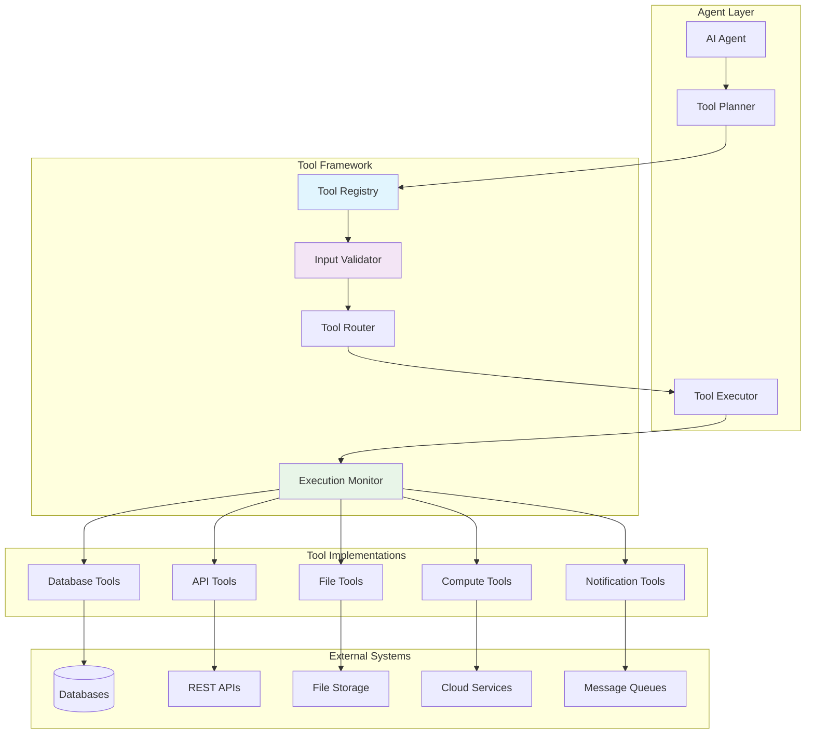
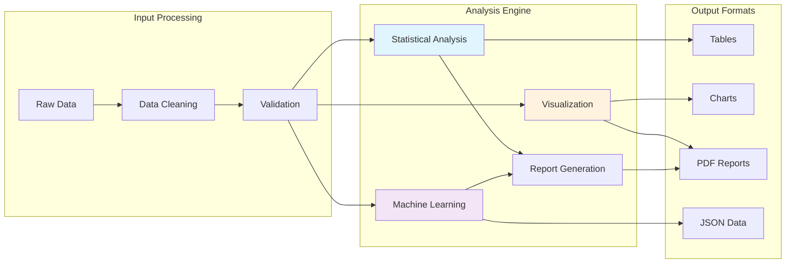
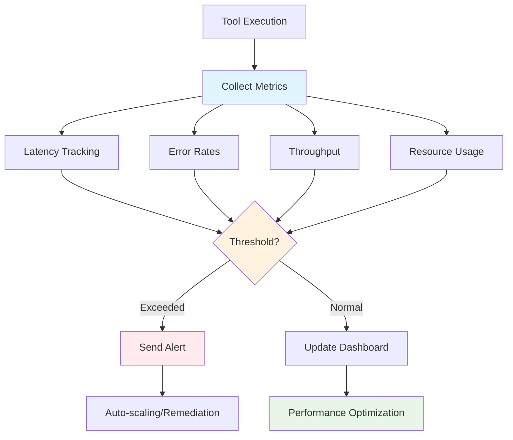

# Tool Integration

Tools are the bridge between AI agents and external systems, enabling agents to interact with databases, APIs, file systems, and other services. Naas provides a standardized framework for creating, managing, and scaling tool integrations.

## Tool Architecture

The tool integration system follows a layered architecture that ensures consistency, security, and maintainability:



**The layered approach provides:**
- **Abstraction**: Agents work with tools through a consistent interface
- **Security**: Input validation and access control at the framework level
- **Monitoring**: Centralized monitoring and logging of all tool executions
- **Scalability**: Tools can be distributed and load-balanced independently

## Standard Tool Definition Pattern

All Naas tools follow a standardized pattern that makes them automatically discoverable and usable by AI agents:

```python
from langchain_core.tools import StructuredTool
from pydantic import BaseModel, Field
from typing import Optional, List, Dict, Any
import asyncio

class DatabaseQuerySchema(BaseModel):
    """
    Input schema for database query tool.
    
    Pydantic models provide automatic validation and documentation
    that helps agents understand how to use the tool correctly.
    """
    query: str = Field(
        ..., 
        description="SQL query to execute. Use proper SQL syntax and include LIMIT clauses for large datasets."
    )
    database: str = Field(
        ..., 
        description="Database connection name. Available options: 'analytics', 'crm', 'inventory'"
    )
    timeout: Optional[int] = Field(
        default=30,
        description="Query timeout in seconds. Maximum allowed is 300 seconds."
    )
    format: Optional[str] = Field(
        default="table",
        description="Output format: 'table', 'json', 'csv'. Default is 'table' for readability."
    )

async def query_database(query: str, database: str, timeout: int = 30, format: str = "table") -> str:
    """
    Execute SQL query against specified database and return formatted results.
    
    This function implements the actual tool logic with proper error handling,
    security measures, and result formatting.
    """
    
    # Validate database access permissions
    if not has_database_access(database, get_current_user()):
        raise PermissionError(f"Access denied to database: {database}")
    
    # Sanitize and validate SQL query
    sanitized_query = sanitize_sql_query(query)
    validate_sql_query(sanitized_query, allowed_operations=['SELECT'])
    
    try:
        # Execute query with timeout
        connection = get_database_connection(database)
        result = await asyncio.wait_for(
            connection.execute(sanitized_query),
            timeout=timeout
        )
        
        # Format results based on requested format
        if format == "json":
            return json.dumps(result.to_dict(), indent=2)
        elif format == "csv":
            return result.to_csv(index=False)
        else:  # table format
            return result.to_string()
            
    except asyncio.TimeoutError:
        return f"Query timed out after {timeout} seconds. Consider adding LIMIT clause or increasing timeout."
    except Exception as e:
        log_tool_error("query_database", str(e), {"query": query, "database": database})
        return f"Database query failed: {str(e)}"
    finally:
        # Ensure connection cleanup
        if 'connection' in locals():
            connection.close()

# Expose as LangChain tool for agent integration
database_tool = StructuredTool(
    name="query_database",
    description="Execute SQL queries against configured databases. Supports SELECT operations on analytics, CRM, and inventory databases.",
    func=query_database,
    args_schema=DatabaseQuerySchema,
    # Additional metadata for tool registry
    tags=["database", "sql", "analytics"],
    version="1.2.0",
    author="Data Team",
    requires_auth=True
)
```

## Tool Categories and Examples

### Data Integration Tools

Tools for connecting with various data sources and systems:

```python
class FileProcessorSchema(BaseModel):
    file_path: str = Field(..., description="Path to file to process")
    operation: str = Field(..., description="Operation: 'read', 'parse', 'analyze'")
    file_type: Optional[str] = Field(default="auto", description="File type: 'excel', 'csv', 'pdf', 'auto'")

async def process_file(file_path: str, operation: str, file_type: str = "auto") -> str:
    """Process various file types and extract information."""
    
    # Auto-detect file type if not specified
    if file_type == "auto":
        file_type = detect_file_type(file_path)
    
    processor_map = {
        "excel": ExcelProcessor(),
        "csv": CSVProcessor(),
        "pdf": PDFProcessor(),
        "docx": WordProcessor(),
        "json": JSONProcessor()
    }
    
    processor = processor_map.get(file_type)
    if not processor:
        return f"Unsupported file type: {file_type}"
    
    try:
        if operation == "read":
            return await processor.read_content(file_path)
        elif operation == "parse":
            return await processor.parse_structure(file_path)
        elif operation == "analyze":
            return await processor.analyze_content(file_path)
        else:
            return f"Unsupported operation: {operation}"
    except Exception as e:
        return f"File processing failed: {str(e)}"

file_processor_tool = StructuredTool(
    name="process_file",
    description="Read, parse, and analyze various file formats including Excel, CSV, PDF, and Word documents",
    func=process_file,
    args_schema=FileProcessorSchema
)
```

### API Integration Tools

Standardized patterns for connecting with external APIs:

```python
class APICallSchema(BaseModel):
    endpoint: str = Field(..., description="API endpoint URL")
    method: str = Field(default="GET", description="HTTP method: GET, POST, PUT, DELETE")
    headers: Optional[Dict[str, str]] = Field(default=None, description="HTTP headers as key-value pairs")
    body: Optional[Dict[str, Any]] = Field(default=None, description="Request body for POST/PUT requests")
    auth_type: Optional[str] = Field(default="none", description="Authentication: 'none', 'bearer', 'basic', 'api_key'")

async def call_external_api(endpoint: str, method: str = "GET", headers: Dict[str, str] = None, 
                           body: Dict[str, Any] = None, auth_type: str = "none") -> str:
    """Make authenticated API calls to external services."""
    
    import aiohttp
    
    # Build request configuration
    request_config = {
        "method": method.upper(),
        "url": endpoint,
        "timeout": aiohttp.ClientTimeout(total=30)
    }
    
    # Add authentication headers
    if auth_type == "bearer":
        token = get_bearer_token(endpoint)
        headers = headers or {}
        headers["Authorization"] = f"Bearer {token}"
    elif auth_type == "api_key":
        api_key = get_api_key(endpoint)
        headers = headers or {}
        headers["X-API-Key"] = api_key
    
    if headers:
        request_config["headers"] = headers
    
    if body and method.upper() in ["POST", "PUT", "PATCH"]:
        request_config["json"] = body
    
    try:
        async with aiohttp.ClientSession() as session:
            async with session.request(**request_config) as response:
                result = {
                    "status_code": response.status,
                    "headers": dict(response.headers),
                    "body": await response.text()
                }
                
                # Try to parse JSON response
                try:
                    result["json"] = await response.json()
                except:
                    pass
                
                return json.dumps(result, indent=2)
                
    except Exception as e:
        return f"API call failed: {str(e)}"

api_call_tool = StructuredTool(
    name="call_external_api",
    description="Make authenticated HTTP requests to external APIs with support for various authentication methods",
    func=call_external_api,
    args_schema=APICallSchema
)
```

### Analysis and Computation Tools

Tools for data analysis and computational tasks:



```python
class DataAnalysisSchema(BaseModel):
    data_source: str = Field(..., description="Data source: table name, file path, or 'clipboard'")
    analysis_type: str = Field(..., description="Analysis: 'descriptive', 'correlation', 'regression', 'clustering'")
    columns: Optional[List[str]] = Field(default=None, description="Specific columns to analyze")
    parameters: Optional[Dict[str, Any]] = Field(default=None, description="Analysis-specific parameters")

async def analyze_data(data_source: str, analysis_type: str, columns: List[str] = None, 
                      parameters: Dict[str, Any] = None) -> str:
    """Perform statistical analysis on datasets."""
    
    import pandas as pd
    import numpy as np
    from sklearn.cluster import KMeans
    from sklearn.linear_model import LinearRegression
    
    # Load data from various sources
    try:
        if data_source.endswith('.csv'):
            df = pd.read_csv(data_source)
        elif data_source.endswith('.xlsx'):
            df = pd.read_excel(data_source)
        elif data_source == 'clipboard':
            df = pd.read_clipboard()
        else:
            # Assume it's a database table
            df = load_from_database(data_source)
        
        # Filter columns if specified
        if columns:
            df = df[columns]
        
        # Perform requested analysis
        if analysis_type == "descriptive":
            result = df.describe()
            return f"Descriptive Statistics:\n{result.to_string()}"
            
        elif analysis_type == "correlation":
            numeric_df = df.select_dtypes(include=[np.number])
            correlation_matrix = numeric_df.corr()
            return f"Correlation Matrix:\n{correlation_matrix.to_string()}"
            
        elif analysis_type == "regression":
            target = parameters.get('target_column')
            features = parameters.get('feature_columns', [])
            
            if not target or not features:
                return "Regression requires 'target_column' and 'feature_columns' parameters"
            
            X = df[features]
            y = df[target]
            
            model = LinearRegression()
            model.fit(X, y)
            
            coefficients = pd.DataFrame({
                'Feature': features,
                'Coefficient': model.coef_
            })
            
            return f"Linear Regression Results:\nR² Score: {model.score(X, y):.4f}\n\nCoefficients:\n{coefficients.to_string()}"
            
        elif analysis_type == "clustering":
            numeric_df = df.select_dtypes(include=[np.number])
            n_clusters = parameters.get('n_clusters', 3)
            
            kmeans = KMeans(n_clusters=n_clusters)
            clusters = kmeans.fit_predict(numeric_df)
            
            cluster_summary = pd.DataFrame({
                'Cluster': range(n_clusters),
                'Size': [sum(clusters == i) for i in range(n_clusters)]
            })
            
            return f"Clustering Results:\n{cluster_summary.to_string()}\n\nCluster Centers:\n{pd.DataFrame(kmeans.cluster_centers_, columns=numeric_df.columns).to_string()}"
        
        else:
            return f"Unsupported analysis type: {analysis_type}"
            
    except Exception as e:
        return f"Data analysis failed: {str(e)}"

data_analysis_tool = StructuredTool(
    name="analyze_data",
    description="Perform statistical analysis including descriptive stats, correlation, regression, and clustering on datasets",
    func=analyze_data,
    args_schema=DataAnalysisSchema
)
```

## Tool Security and Access Control

Security is implemented at multiple levels to ensure safe tool execution:

```python
from enum import Enum
from typing import Set

class Permission(Enum):
    READ_DATA = "read_data"
    WRITE_DATA = "write_data"
    EXTERNAL_API = "external_api"
    SENSITIVE_INFO = "sensitive_info"
    ADMIN_OPERATIONS = "admin_operations"

class SecureToolRegistry:
    """
    Registry that manages tool access based on user permissions and context.
    """
    
    def __init__(self):
        self.tools = {}
        self.tool_permissions = {}
        self.user_permissions = {}
        self.audit_logger = AuditLogger()
    
    def register_tool(self, tool: StructuredTool, required_permissions: Set[Permission]):
        """Register a tool with its required permissions."""
        self.tools[tool.name] = tool
        self.tool_permissions[tool.name] = required_permissions
    
    def get_available_tools(self, user_id: str, context: Dict[str, Any] = None) -> List[StructuredTool]:
        """Get tools available to a specific user based on their permissions."""
        user_perms = self.user_permissions.get(user_id, set())
        available_tools = []
        
        for tool_name, tool in self.tools.items():
            required_perms = self.tool_permissions.get(tool_name, set())
            
            # Check if user has all required permissions
            if required_perms.issubset(user_perms):
                # Additional context-based checks
                if self._validate_context_access(tool_name, user_id, context):
                    available_tools.append(tool)
        
        self.audit_logger.log_tool_access_request(user_id, [t.name for t in available_tools])
        return available_tools
    
    def execute_tool(self, tool_name: str, user_id: str, inputs: Dict[str, Any]) -> Any:
        """Execute tool with security validation and audit logging."""
        
        # Validate access
        if not self._validate_tool_access(tool_name, user_id):
            raise PermissionError(f"Access denied to tool: {tool_name}")
        
        # Sanitize inputs
        sanitized_inputs = self._sanitize_inputs(tool_name, inputs)
        
        # Log execution attempt
        self.audit_logger.log_tool_execution_start(user_id, tool_name, sanitized_inputs)
        
        try:
            tool = self.tools[tool_name]
            result = tool.func(**sanitized_inputs)
            
            # Log successful execution
            self.audit_logger.log_tool_execution_success(user_id, tool_name, result)
            return result
            
        except Exception as e:
            # Log execution failure
            self.audit_logger.log_tool_execution_failure(user_id, tool_name, str(e))
            raise
    
    def _validate_context_access(self, tool_name: str, user_id: str, context: Dict[str, Any]) -> bool:
        """Additional context-based access validation."""
        
        # Example: Database tools require specific database access
        if tool_name == "query_database":
            requested_db = context.get("database")
            return self._has_database_access(user_id, requested_db)
        
        # Example: File tools require file path validation
        if tool_name == "process_file":
            file_path = context.get("file_path", "")
            return self._validate_file_path(user_id, file_path)
        
        return True
    
    def _sanitize_inputs(self, tool_name: str, inputs: Dict[str, Any]) -> Dict[str, Any]:
        """Sanitize tool inputs to prevent injection attacks."""
        
        sanitized = {}
        for key, value in inputs.items():
            if isinstance(value, str):
                # Basic SQL injection prevention
                if "query" in key.lower():
                    sanitized[key] = sanitize_sql_query(value)
                # Path traversal prevention
                elif "path" in key.lower():
                    sanitized[key] = sanitize_file_path(value)
                # General string sanitization
                else:
                    sanitized[key] = sanitize_string(value)
            else:
                sanitized[key] = value
        
        return sanitized
```

## Tool Performance and Monitoring

Comprehensive monitoring ensures tools perform reliably at scale:



```python
import time
import asyncio
from dataclasses import dataclass
from typing import Dict, List, Optional

@dataclass
class ToolMetrics:
    tool_name: str
    execution_count: int
    total_duration: float
    error_count: int
    last_executed: float
    average_duration: float
    
    @property
    def error_rate(self) -> float:
        return self.error_count / max(self.execution_count, 1)

class ToolMonitor:
    """
    Comprehensive monitoring for tool performance and reliability.
    """
    
    def __init__(self):
        self.metrics: Dict[str, ToolMetrics] = {}
        self.performance_thresholds = {
            "max_duration": 30.0,  # seconds
            "max_error_rate": 0.05,  # 5%
            "min_throughput": 10  # requests per minute
        }
    
    def monitor_tool_execution(self, tool_name: str):
        """Decorator to monitor tool execution."""
        def decorator(func):
            async def wrapper(*args, **kwargs):
                start_time = time.time()
                
                try:
                    result = await func(*args, **kwargs)
                    duration = time.time() - start_time
                    self._record_success(tool_name, duration)
                    return result
                    
                except Exception as e:
                    duration = time.time() - start_time
                    self._record_error(tool_name, duration, e)
                    raise
                    
            return wrapper
        return decorator
    
    def _record_success(self, tool_name: str, duration: float):
        """Record successful tool execution."""
        if tool_name not in self.metrics:
            self.metrics[tool_name] = ToolMetrics(
                tool_name=tool_name,
                execution_count=0,
                total_duration=0.0,
                error_count=0,
                last_executed=0.0,
                average_duration=0.0
            )
        
        metrics = self.metrics[tool_name]
        metrics.execution_count += 1
        metrics.total_duration += duration
        metrics.last_executed = time.time()
        metrics.average_duration = metrics.total_duration / metrics.execution_count
        
        # Check performance thresholds
        self._check_performance_alerts(tool_name, metrics)
    
    def _record_error(self, tool_name: str, duration: float, error: Exception):
        """Record failed tool execution."""
        if tool_name not in self.metrics:
            self.metrics[tool_name] = ToolMetrics(
                tool_name=tool_name,
                execution_count=0,
                total_duration=0.0,
                error_count=0,
                last_executed=0.0,
                average_duration=0.0
            )
        
        metrics = self.metrics[tool_name]
        metrics.execution_count += 1
        metrics.error_count += 1
        metrics.total_duration += duration
        metrics.last_executed = time.time()
        metrics.average_duration = metrics.total_duration / metrics.execution_count
        
        # Log error details
        self._log_tool_error(tool_name, error, duration)
        
        # Check error rate alerts
        self._check_performance_alerts(tool_name, metrics)
    
    def _check_performance_alerts(self, tool_name: str, metrics: ToolMetrics):
        """Check if performance thresholds are exceeded."""
        alerts = []
        
        if metrics.average_duration > self.performance_thresholds["max_duration"]:
            alerts.append(f"High latency: {metrics.average_duration:.2f}s")
        
        if metrics.error_rate > self.performance_thresholds["max_error_rate"]:
            alerts.append(f"High error rate: {metrics.error_rate:.2%}")
        
        if alerts:
            self._send_performance_alert(tool_name, alerts, metrics)
    
    def get_performance_report(self) -> Dict[str, Any]:
        """Generate comprehensive performance report."""
        report = {
            "timestamp": time.time(),
            "tool_metrics": {},
            "system_health": "healthy",
            "recommendations": []
        }
        
        for tool_name, metrics in self.metrics.items():
            report["tool_metrics"][tool_name] = {
                "executions": metrics.execution_count,
                "avg_duration": metrics.average_duration,
                "error_rate": metrics.error_rate,
                "last_executed": metrics.last_executed
            }
            
            # Add recommendations based on metrics
            if metrics.error_rate > 0.1:
                report["recommendations"].append(f"{tool_name}: High error rate, investigate implementation")
            
            if metrics.average_duration > 10.0:
                report["recommendations"].append(f"{tool_name}: Slow performance, consider optimization")
        
        return report
```

This comprehensive tool integration framework ensures that Naas agents can reliably interact with any external system while maintaining security, performance, and observability standards required for enterprise deployments.
