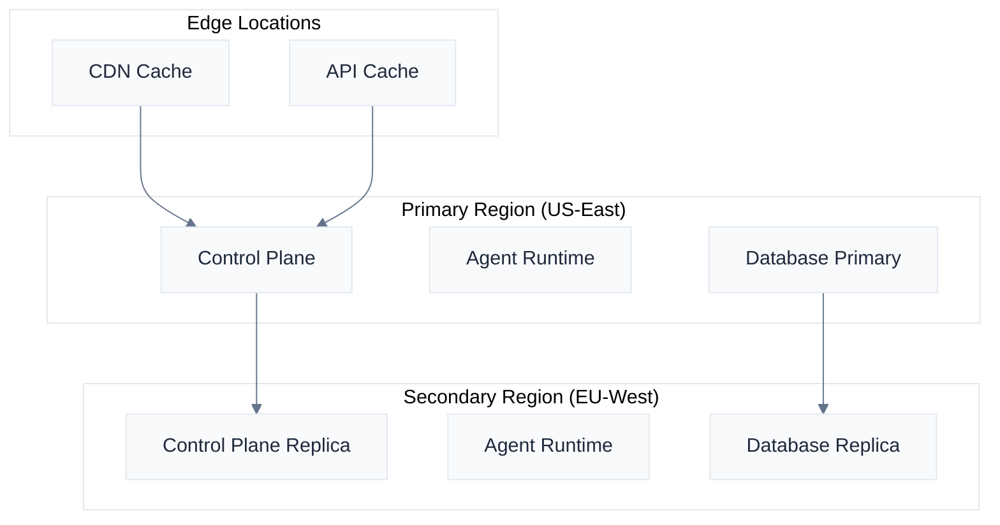
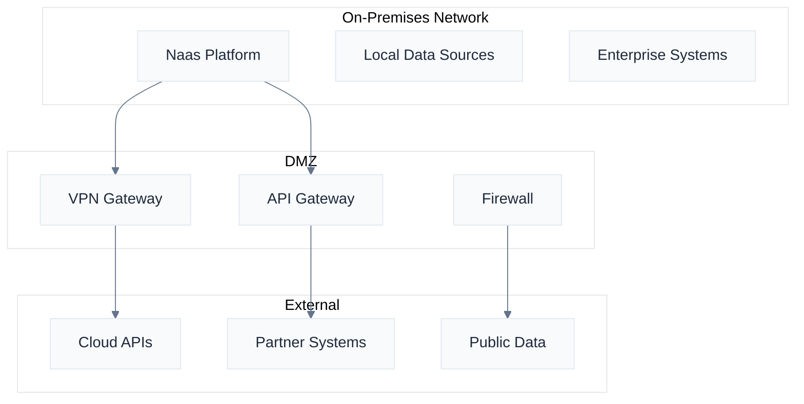

# Deployment Models

Naas supports multiple deployment models to meet diverse enterprise requirements, from cloud-native SaaS deployments to air-gapped government installations. Each model is designed to maintain full platform functionality while meeting specific security, compliance, and operational needs.

:::info Professional Services Implementation
The enterprise capabilities described in this section represent our ability to implement these solutions through our professional services team. Each deployment is customized to your specific requirements and implemented with dedicated support. Contact our enterprise team at [support@naas.ai](mailto:support@naas.ai) to discuss your needs and implementation timeline.
:::

## Cloud-Native Deployment

### Kubernetes-Native Architecture

Naas is built from the ground up as a cloud-native application, leveraging Kubernetes for container orchestration and management.

**Core Components**:
- **Control Plane**: Manages platform configuration, user management, and orchestration
- **Agent Runtime**: Executes AI agents with auto-scaling based on demand
- **Data Layer**: Distributed storage with automatic replication and backup
- **API Gateway**: Secure API access with rate limiting and authentication

**Kubernetes Resources**:
```yaml
# Example Naas deployment configuration
apiVersion: apps/v1
kind: Deployment
metadata:
  name: naas-platform
spec:
  replicas: 3
  selector:
    matchLabels:
      app: naas-platform
  template:
    spec:
      containers:
      - name: naas-api
        image: naas/platform:latest
        resources:
          requests:
            memory: "2Gi"
            cpu: "1000m"
          limits:
            memory: "4Gi"
            cpu: "2000m"
```

### Multi-Region Deployment

**Global Distribution Strategy**:
- **Primary Region**: Main deployment with full functionality
- **Secondary Regions**: Read replicas with failover capability
- **Edge Locations**: Cached responses for improved performance
- **Data Residency**: Configurable data storage locations for compliance

**Regional Architecture**:


### Auto-Scaling Configuration

**Horizontal Pod Autoscaler (HPA)**:
```yaml
apiVersion: autoscaling/v2
kind: HorizontalPodAutoscaler
metadata:
  name: naas-agent-hpa
spec:
  scaleTargetRef:
    apiVersion: apps/v1
    kind: Deployment
    name: naas-agent-runtime
  minReplicas: 2
  maxReplicas: 50
  metrics:
  - type: Resource
    resource:
      name: cpu
      target:
        type: Utilization
        averageUtilization: 70
  - type: Resource
    resource:
      name: memory
      target:
        type: Utilization
        averageUtilization: 80
```

**Vertical Pod Autoscaler (VPA)**:
- Automatic resource request optimization
- Memory and CPU usage analysis
- Recommendation-based scaling
- Cost optimization through right-sizing

### Managed Service Options

**AWS Deployment**:
- **EKS**: Managed Kubernetes with AWS integration
- **RDS**: Managed database with automatic backups
- **ElastiCache**: Redis caching for improved performance
- **ALB**: Application load balancer with SSL termination

**Google Cloud Deployment**:
- **GKE**: Google Kubernetes Engine with autopilot mode
- **Cloud SQL**: Managed PostgreSQL with high availability
- **Memorystore**: Managed Redis for caching
- **Cloud Load Balancing**: Global load balancing with CDN

**Azure Deployment**:
- **AKS**: Azure Kubernetes Service with Azure integration
- **Azure Database**: Managed PostgreSQL with geo-replication
- **Azure Cache**: Redis cache with clustering support
- **Application Gateway**: Layer 7 load balancing with WAF

## On-Premises Installation

### Air-Gapped Environment Setup

**Complete Offline Operation**:
- No external internet connectivity required
- Local container registry for all images
- Offline model hosting and inference
- Local documentation and support resources

**Infrastructure Requirements**:
```yaml
# Minimum hardware specifications
control_plane:
  nodes: 3
  cpu_per_node: 8 cores
  memory_per_node: 32 GB
  storage_per_node: 500 GB SSD

worker_nodes:
  nodes: 5
  cpu_per_node: 16 cores
  memory_per_node: 64 GB
  storage_per_node: 1 TB SSD
  gpu_optional: NVIDIA A100 or equivalent

storage:
  distributed_storage: 10 TB minimum
  backup_storage: 20 TB minimum
  replication_factor: 3
```

**Local Model Hosting**:
- **Ollama Integration**: Local LLM hosting with GPU acceleration
- **Model Registry**: Private model repository with version control
- **Inference Scaling**: Automatic model loading and unloading
- **Custom Models**: Support for fine-tuned and domain-specific models

### Hybrid Connectivity

**Secure External Connections**:
- **VPN Tunnels**: Site-to-site VPN for secure data access
- **API Gateways**: Controlled external API access with monitoring
- **Data Sync**: Scheduled synchronization with external data sources
- **Audit Logging**: Complete logging of all external communications

**Network Architecture**:


### Custom Infrastructure Integration

**Enterprise System Integration**:
- **Active Directory**: LDAP/SAML integration for authentication
- **Database Connections**: Direct connections to enterprise databases
- **Message Queues**: Integration with existing messaging systems
- **Monitoring Systems**: Integration with enterprise monitoring tools

**Hardware Optimization**:
- **GPU Clusters**: NVIDIA DGX or equivalent for AI workloads
- **High-Performance Storage**: NVMe SSD arrays for fast data access
- **Network Optimization**: 10GbE or higher for inter-node communication
- **Backup Systems**: Integration with enterprise backup solutions

## Government and Defense Deployments

### FedRAMP Compliance

**FedRAMP Moderate Requirements**:
- **Security Controls**: Implementation of NIST SP 800-53 controls
- **Continuous Monitoring**: Real-time security monitoring and reporting
- **Incident Response**: Automated incident detection and response procedures
- **Documentation**: Complete system security documentation

**FedRAMP High Requirements**:
- **Enhanced Controls**: Additional security controls for high-impact systems
- **Cryptographic Standards**: FIPS 140-2 Level 3 or higher
- **Personnel Security**: Background check requirements for system access
- **Physical Security**: Enhanced physical security controls

### DoD Compliance

**Security Requirements Guide (SRG) Compliance**:
- **STIG Implementation**: Security Technical Implementation Guides
- **Risk Management Framework**: NIST RMF implementation
- **Continuous Monitoring**: Real-time security posture assessment
- **Vulnerability Management**: Automated vulnerability scanning and remediation

**Classification Level Support**:
- **Unclassified**: Standard security controls
- **Controlled Unclassified Information (CUI)**: Enhanced data protection
- **Classified**: Support for classified data processing (with appropriate accreditation)

### GovCloud Deployment

**AWS GovCloud Integration**:
- **Isolated Regions**: Physically and logically separated infrastructure
- **Compliance**: FedRAMP High and DoD SRG compliance
- **Personnel**: US persons-only access to infrastructure
- **Audit**: Enhanced audit logging and compliance reporting

**Azure Government Integration**:
- **Government Regions**: Dedicated government cloud regions
- **Compliance Certifications**: FedRAMP, DoD SRG, and other government standards
- **Data Residency**: Guaranteed US data residency
- **Support**: Government-cleared support personnel

### SCIF Compatibility

**Sensitive Compartmented Information Facility Requirements**:
- **Physical Security**: Compliance with ICD/ICS 705 standards
- **Electromagnetic Security**: TEMPEST compliance for classified processing
- **Access Control**: Biometric and multi-factor authentication
- **Audit Trail**: Complete audit trail for all system access and operations

**Deployment Patterns**:
```yaml
# SCIF deployment configuration
scif_deployment:
  physical_security:
    - tempest_compliance: true
    - acoustic_protection: true
    - visual_protection: true
  
  network_security:
    - air_gapped: true
    - encrypted_storage: "AES-256"
    - secure_communications: "Suite B cryptography"
  
  access_control:
    - biometric_authentication: true
    - multi_factor_authentication: true
    - continuous_monitoring: true
```

## Deployment Planning

### Requirements Assessment

**Security Requirements**:
- Compliance frameworks (FedRAMP, SOC 2, ISO 27001)
- Data classification and handling requirements
- Network security and segmentation needs
- Authentication and authorization requirements

**Performance Requirements**:
- Expected user load and concurrent sessions
- Data processing and storage requirements
- Response time and availability targets
- Disaster recovery and business continuity needs

**Integration Requirements**:
- Existing system integration points
- Data source connections and formats
- API requirements and rate limits
- Monitoring and logging integration

### Architecture Design

**Reference Architectures**:
- **Small Deployment**: Single region, 100-500 users
- **Medium Deployment**: Multi-region, 500-5000 users
- **Large Deployment**: Global, 5000+ users with high availability
- **Government Deployment**: Air-gapped or GovCloud with enhanced security

**Capacity Planning**:
```yaml
# Capacity planning template
deployment_size: medium
expected_users: 2000
concurrent_users: 400
data_volume: 10TB
growth_rate: 20% annually

infrastructure:
  kubernetes_nodes: 12
  cpu_cores: 192
  memory_gb: 768
  storage_tb: 50
  network_bandwidth: "10 Gbps"
```

### Implementation Timeline

**Phase 1: Foundation (Weeks 1-4)**:
- Infrastructure provisioning
- Network configuration and security setup
- Basic platform installation and configuration
- Initial testing and validation

**Phase 2: Integration (Weeks 5-8)**:
- Enterprise system integration
- Data source connections
- Authentication and authorization setup
- Security hardening and compliance validation

**Phase 3: Deployment (Weeks 9-12)**:
- Production deployment and cutover
- User onboarding and training
- Performance optimization and tuning
- Go-live support and monitoring setup

**Phase 4: Optimization (Weeks 13-16)**:
- Performance monitoring and optimization
- User feedback incorporation
- Additional feature enablement
- Long-term support transition

For detailed deployment planning assistance, contact our enterprise team at [enterprise@naas.ai](mailto:enterprise@naas.ai).
