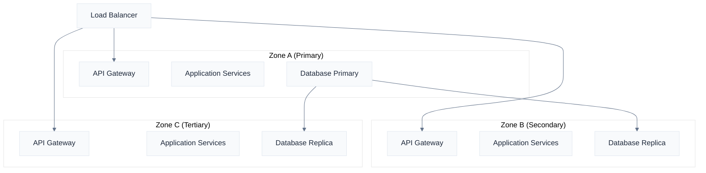
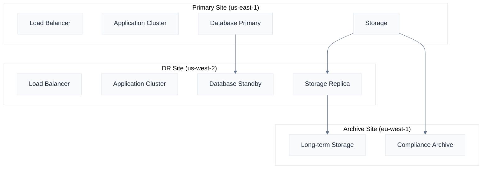

# High Availability & Disaster Recovery

Naas is architected for enterprise-grade availability and resilience, with comprehensive disaster recovery capabilities that ensure business continuity even in the face of major infrastructure failures. Our multi-layered approach to availability provides 99.9%+ uptime guarantees with rapid recovery capabilities.

## High Availability Architecture

### Multi-Zone Deployment

**Availability Zone Strategy**:
- **Primary Zone**: Main operational zone with full capacity
- **Secondary Zones**: Hot standby zones with automatic failover
- **Cross-Zone Replication**: Real-time data replication across zones
- **Load Distribution**: Intelligent traffic distribution across zones

**Zone Failure Scenarios**:


**Automatic Failover Configuration**:
```yaml
# High availability configuration
high_availability:
  zones:
    primary: "us-east-1a"
    secondary: ["us-east-1b", "us-east-1c"]
  
  failover:
    detection_timeout: "30 seconds"
    failover_time: "2 minutes"
    automatic: true
    health_checks:
      - endpoint: "/health"
        interval: "10 seconds"
        timeout: "5 seconds"
        retries: 3
  
  load_balancing:
    algorithm: "least_connections"
    sticky_sessions: false
    health_check_grace_period: "60 seconds"
```

### Database High Availability

**PostgreSQL High Availability**:
- **Streaming Replication**: Synchronous replication for zero data loss
- **Connection Pooling**: PgBouncer for connection management
- **Automatic Failover**: Patroni for automated failover management
- **Point-in-Time Recovery**: Continuous WAL archiving

**Database Cluster Configuration**:
```yaml
# PostgreSQL HA configuration
postgresql_ha:
  cluster_name: "naas-postgres"
  
  nodes:
    primary:
      name: "postgres-primary"
      zone: "us-east-1a"
      instance_type: "db.r5.2xlarge"
    
    replicas:
      - name: "postgres-replica-1"
        zone: "us-east-1b"
        instance_type: "db.r5.2xlarge"
        replication: "synchronous"
      
      - name: "postgres-replica-2"
        zone: "us-east-1c"
        instance_type: "db.r5.2xlarge"
        replication: "asynchronous"
  
  failover:
    automatic: true
    timeout: "30 seconds"
    promotion_timeout: "60 seconds"
```

**Redis High Availability**:
- **Redis Sentinel**: Automatic failover for Redis instances
- **Cluster Mode**: Distributed Redis cluster for scalability
- **Persistence**: RDB and AOF persistence for data durability
- **Memory Management**: Automatic memory optimization and eviction

### Service Mesh Resilience

**Istio Service Mesh**:
- **Circuit Breakers**: Automatic failure detection and isolation
- **Retry Policies**: Configurable retry logic with exponential backoff
- **Timeout Management**: Request timeout configuration
- **Traffic Splitting**: Gradual traffic migration during deployments

**Circuit Breaker Configuration**:
```yaml
# Istio circuit breaker configuration
apiVersion: networking.istio.io/v1beta1
kind: DestinationRule
metadata:
  name: naas-api-circuit-breaker
spec:
  host: naas-api-service
  trafficPolicy:
    outlierDetection:
      consecutiveErrors: 3
      interval: 30s
      baseEjectionTime: 30s
      maxEjectionPercent: 50
    connectionPool:
      tcp:
        maxConnections: 100
      http:
        http1MaxPendingRequests: 50
        maxRequestsPerConnection: 10
```

**Retry and Timeout Policies**:
```yaml
# Retry and timeout configuration
apiVersion: networking.istio.io/v1beta1
kind: VirtualService
metadata:
  name: naas-api-retry-policy
spec:
  http:
  - retries:
      attempts: 3
      perTryTimeout: 10s
      retryOn: "5xx,reset,connect-failure,refused-stream"
    timeout: 30s
```

### Application-Level Resilience

**Graceful Degradation**:
- **Feature Flags**: Dynamic feature enabling/disabling
- **Fallback Mechanisms**: Alternative processing paths during failures
- **Cache Strategies**: Multi-level caching for improved resilience
- **Asynchronous Processing**: Queue-based processing for non-critical operations

**Health Check Implementation**:
```python
# Application health check example
from fastapi import FastAPI, HTTPException
from typing import Dict, Any
import asyncio
import time

app = FastAPI()

class HealthChecker:
    def __init__(self):
        self.checks = {
            "database": self.check_database,
            "redis": self.check_redis,
            "external_api": self.check_external_api
        }
    
    async def check_database(self) -> Dict[str, Any]:
        try:
            # Database connectivity check
            result = await db.execute("SELECT 1")
            return {
                "status": "healthy",
                "response_time": 0.05,
                "details": "Database connection successful"
            }
        except Exception as e:
            return {
                "status": "unhealthy",
                "error": str(e),
                "details": "Database connection failed"
            }
    
    async def check_redis(self) -> Dict[str, Any]:
        try:
            # Redis connectivity check
            await redis.ping()
            return {
                "status": "healthy",
                "response_time": 0.02,
                "details": "Redis connection successful"
            }
        except Exception as e:
            return {
                "status": "unhealthy",
                "error": str(e),
                "details": "Redis connection failed"
            }

@app.get("/health")
async def health_check():
    checker = HealthChecker()
    results = {}
    overall_status = "healthy"
    
    for check_name, check_func in checker.checks.items():
        result = await check_func()
        results[check_name] = result
        if result["status"] != "healthy":
            overall_status = "unhealthy"
    
    return {
        "status": overall_status,
        "timestamp": time.time(),
        "checks": results
    }
```

## Disaster Recovery

### Recovery Time and Point Objectives

**Service Level Objectives**:
- **RTO (Recovery Time Objective)**: Maximum acceptable downtime
- **RPO (Recovery Point Objective)**: Maximum acceptable data loss
- **MTTR (Mean Time to Recovery)**: Average time to restore service
- **MTBF (Mean Time Between Failures)**: Average time between failures

**SLA Tiers**:
```yaml
# Disaster recovery SLA tiers
sla_tiers:
  standard:
    rto: "4 hours"
    rpo: "1 hour"
    availability: "99.9%"
    support: "business hours"
  
  premium:
    rto: "1 hour"
    rpo: "15 minutes"
    availability: "99.95%"
    support: "24/7"
  
  enterprise:
    rto: "30 minutes"
    rpo: "5 minutes"
    availability: "99.99%"
    support: "24/7 with dedicated TAM"
```

### Backup Strategies

**Comprehensive Backup Coverage**:
- **Database Backups**: Continuous WAL archiving with point-in-time recovery
- **File System Backups**: Incremental backups of application data
- **Configuration Backups**: Version-controlled infrastructure and application configuration
- **Secrets Backup**: Encrypted backup of secrets and certificates

**Backup Schedule and Retention**:
```yaml
# Backup configuration
backup_strategy:
  database:
    full_backup:
      schedule: "daily at 2:00 AM UTC"
      retention: "30 days"
    
    incremental_backup:
      schedule: "every 4 hours"
      retention: "7 days"
    
    wal_archiving:
      enabled: true
      retention: "7 days"
  
  filesystem:
    schedule: "daily at 3:00 AM UTC"
    retention: "14 days"
    compression: true
    encryption: true
  
  configuration:
    schedule: "on every change"
    retention: "90 days"
    versioning: true
```

**Cross-Region Backup Replication**:
- **Primary Region**: us-east-1 (production and primary backups)
- **Secondary Region**: us-west-2 (backup replication and DR site)
- **Tertiary Region**: eu-west-1 (long-term archive storage)

### Disaster Recovery Sites

**Hot Standby Site**:
- **Real-time Replication**: Continuous data replication to DR site
- **Warm Infrastructure**: Pre-provisioned infrastructure ready for activation
- **Automated Failover**: Automatic failover with minimal manual intervention
- **Regular Testing**: Monthly DR testing and validation

**DR Site Architecture**:


**Cold Standby Site**:
- **Backup Restoration**: Recovery from backups stored in secondary region
- **Infrastructure Provisioning**: Automated infrastructure provisioning during DR
- **Extended Recovery Time**: Longer recovery time but lower cost
- **Quarterly Testing**: Quarterly DR testing and validation

### Disaster Recovery Procedures

**Disaster Declaration Process**:
1. **Incident Detection**: Automated monitoring or manual reporting
2. **Impact Assessment**: Evaluate scope and severity of the incident
3. **Disaster Declaration**: Formal declaration by incident commander
4. **DR Team Activation**: Activate disaster recovery team and procedures
5. **Stakeholder Notification**: Notify customers, partners, and regulators

**Recovery Procedures**:
```yaml
# Disaster recovery runbook
disaster_recovery:
  detection:
    - automated_monitoring: "System health checks fail"
    - manual_trigger: "Operations team declares disaster"
    - external_notification: "Cloud provider outage notification"
  
  assessment:
    - scope_evaluation: "Determine affected systems and users"
    - impact_analysis: "Assess business impact and urgency"
    - recovery_strategy: "Select appropriate recovery approach"
  
  execution:
    - infrastructure_activation: "Provision DR infrastructure"
    - data_restoration: "Restore data from backups or replicas"
    - service_validation: "Validate service functionality"
    - traffic_redirection: "Redirect user traffic to DR site"
  
  communication:
    - internal_notification: "Notify internal stakeholders"
    - customer_communication: "Update status page and notify customers"
    - regulatory_reporting: "File required regulatory reports"
```

**Recovery Validation**:
- **Smoke Tests**: Basic functionality verification
- **Integration Tests**: End-to-end workflow validation
- **Performance Tests**: System performance validation
- **Security Tests**: Security control validation

## Business Continuity

### Continuity Planning

**Business Impact Analysis**:
- **Critical Processes**: Identification of mission-critical business processes
- **Dependencies**: Mapping of system and process dependencies
- **Recovery Priorities**: Prioritization of recovery activities
- **Resource Requirements**: Identification of required resources for recovery

**Continuity Strategies**:
```yaml
# Business continuity strategies
continuity_strategies:
  prevention:
    - redundant_systems: "Multiple availability zones"
    - proactive_monitoring: "24/7 system monitoring"
    - preventive_maintenance: "Regular system maintenance"
  
  mitigation:
    - graceful_degradation: "Reduced functionality during incidents"
    - load_shedding: "Prioritize critical operations"
    - alternative_workflows: "Manual processes when systems unavailable"
  
  recovery:
    - automated_failover: "Automatic system recovery"
    - manual_procedures: "Documented manual recovery steps"
    - communication_plans: "Stakeholder communication procedures"
```

### Crisis Communication

**Communication Channels**:
- **Status Page**: Public status page for service availability
- **Email Notifications**: Automated email alerts to subscribers
- **SMS Alerts**: Critical alerts via SMS for urgent issues
- **Social Media**: Updates via Twitter and LinkedIn
- **Direct Communication**: Phone calls for major customers

**Communication Templates**:
```yaml
# Crisis communication templates
communication_templates:
  incident_notification:
    subject: "Service Disruption - [Service Name]"
    template: |
      We are currently experiencing an issue with [service_name] that began at [start_time].
      
      Impact: [impact_description]
      Current Status: [current_status]
      Next Update: [next_update_time]
      
      We apologize for any inconvenience and are working to resolve this as quickly as possible.
  
  resolution_notification:
    subject: "Service Restored - [Service Name]"
    template: |
      The issue with [service_name] has been resolved as of [resolution_time].
      
      Root Cause: [root_cause_summary]
      Resolution: [resolution_summary]
      
      We will conduct a post-incident review and share findings within 48 hours.
```

### Testing and Validation

**DR Testing Schedule**:
- **Monthly**: Backup restoration testing
- **Quarterly**: Partial DR site activation
- **Semi-annually**: Full DR site failover test
- **Annually**: Comprehensive business continuity exercise

**Testing Procedures**:
```yaml
# DR testing procedures
dr_testing:
  backup_restoration:
    frequency: "monthly"
    scope: "database and critical data"
    validation: "data integrity and completeness"
    rollback: "automatic rollback after testing"
  
  failover_testing:
    frequency: "quarterly"
    scope: "application services failover"
    validation: "end-to-end functionality"
    duration: "4 hours maximum"
  
  full_dr_exercise:
    frequency: "annually"
    scope: "complete system failover"
    validation: "business process continuity"
    stakeholders: "all business units"
```

**Test Results Documentation**:
- **Test Execution Logs**: Detailed logs of all test activities
- **Performance Metrics**: Recovery time and data loss measurements
- **Issue Identification**: Documentation of any issues discovered
- **Improvement Recommendations**: Recommendations for process improvements

## Monitoring and Alerting

### Comprehensive Monitoring

**Infrastructure Monitoring**:
- **Server Metrics**: CPU, memory, disk, network utilization
- **Container Metrics**: Pod resource usage and health status
- **Network Metrics**: Bandwidth utilization and latency
- **Storage Metrics**: Disk usage, IOPS, and throughput

**Application Monitoring**:
- **Response Times**: API and web interface response times
- **Error Rates**: Application error rates and types
- **Throughput**: Request volume and processing rates
- **User Experience**: Real user monitoring and synthetic testing

**Monitoring Stack**:
```yaml
# Monitoring configuration
monitoring:
  metrics:
    prometheus:
      retention: "30 days"
      scrape_interval: "15 seconds"
      alerting_rules: "custom_rules.yml"
    
    grafana:
      dashboards: "infrastructure, application, business"
      alerting: "integrated with PagerDuty"
  
  logging:
    elasticsearch:
      retention: "90 days"
      indices: "daily rotation"
      replicas: 2
    
    kibana:
      dashboards: "security, application, audit"
      access_control: "role-based"
  
  tracing:
    jaeger:
      sampling_rate: "0.1%"
      retention: "7 days"
      storage: "elasticsearch"
```

### Intelligent Alerting

**Alert Categories**:
- **Critical**: Immediate response required (page on-call engineer)
- **Warning**: Issue requires attention within business hours
- **Info**: Informational alerts for trend analysis

**Alert Escalation**:
```yaml
# Alert escalation configuration
alerting:
  escalation_policies:
    critical:
      - level_1: "on_call_engineer"
        timeout: "5 minutes"
      - level_2: "engineering_manager"
        timeout: "15 minutes"
      - level_3: "cto"
        timeout: "30 minutes"
    
    warning:
      - level_1: "engineering_team_slack"
        timeout: "30 minutes"
      - level_2: "engineering_manager"
        timeout: "2 hours"
  
  notification_channels:
    - pagerduty: "critical alerts"
    - slack: "warning and info alerts"
    - email: "daily summary reports"
```

For detailed high availability implementation guidance, contact our infrastructure team at [infrastructure@naas.ai](mailto:infrastructure@naas.ai).
