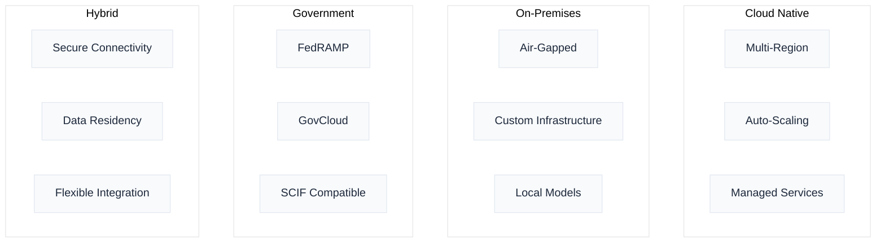

# Enterprise Deployment Overview

Naas is architected for enterprise-grade deployments that meet the most stringent security, compliance, and operational requirements. From air-gapped government installations to multi-tenant SaaS deployments, our platform's modular architecture enables secure scaling without compromising functionality.

## Enterprise-Ready Architecture

### Core Capabilities
- **Multi-deployment models**: Cloud-native, on-premises, hybrid, and air-gapped
- **Enterprise security**: Zero trust architecture with comprehensive compliance frameworks
- **High availability**: 99.9%+ uptime with automatic failover and disaster recovery
- **Scalable infrastructure**: Kubernetes-native with intelligent auto-scaling
- **Compliance ready**: SOC 2, ISO 27001, FedRAMP, GDPR, and HIPAA support

### Deployment Flexibility

## Implementation Approach

### Phase 1: Assessment & Planning
- **Requirements analysis**: Security, compliance, and performance needs
- **Architecture design**: Custom deployment architecture
- **Proof of concept**: Validation deployment with key stakeholders
- **Security review**: Comprehensive security assessment and approval

### Phase 2: Deployment & Integration
- **Infrastructure setup**: Automated provisioning and configuration
- **Platform deployment**: Naas installation and initial configuration
- **System integration**: Connect to existing enterprise systems
- **Security hardening**: Implementation of security controls and policies

### Phase 3: Operations & Optimization
- **Monitoring implementation**: Comprehensive observability and alerting
- **User onboarding**: Training and enablement programs
- **Performance tuning**: Optimization based on usage patterns
- **Continuous improvement**: Regular reviews and enhancements

## Enterprise Support

### Professional Services
- **Architecture consulting**: Custom deployment design and planning
- **Security assessment**: Comprehensive security review and recommendations
- **Migration assistance**: Legacy system migration and integration
- **Training programs**: Technical and user training for successful adoption

### Support Tiers
- **Professional**: Business hours support with SLA guarantees
- **Enterprise**: 24/7 support with dedicated technical account management
- **Mission-Critical**: Premium support for critical deployments with guaranteed response times

## Detailed Guides

### Deployment Models
- **[Deployment Models](./deployment-models)**: Comprehensive guide to cloud, on-premises, and government deployment options

### Security & Compliance
- **[Security & Compliance](./security-compliance)**: Detailed security architecture, compliance frameworks, and audit procedures

### High Availability
- **[High Availability & Disaster Recovery](./high-availability)**: Fault tolerance, backup strategies, and business continuity planning

### Specialized Deployments
- **[Air-Gapped Deployment](./air-gapped)**: Complete offline deployment guide for secure environments
- **[Performance & Scalability](./performance-scalability)**: Optimization strategies and scaling best practices

## Getting Started

Ready to deploy Naas in your enterprise environment? Our enterprise team provides comprehensive support throughout the entire deployment lifecycle.

**Next Steps**:
1. **Schedule a consultation** to discuss your specific requirements
2. **Receive a custom architecture proposal** tailored to your needs
3. **Begin with a proof of concept** to validate the approach
4. **Deploy with confidence** using our proven methodologies

For deployment planning assistance, [contact our enterprise team](mailto:enterprise@naas.ai) or [schedule a consultation](https://naas.ai/enterprise-consultation).
