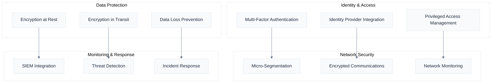

# Security & Compliance

Naas implements enterprise-grade security controls and compliance frameworks to meet the most stringent organizational requirements. Our security-by-design approach ensures data protection, regulatory compliance, and operational security across all deployment models.

## Security Architecture

### Zero Trust Security Model

Naas implements a comprehensive zero trust security architecture that assumes no implicit trust and continuously validates every transaction.

**Core Principles**:
- **Never Trust, Always Verify**: Every request is authenticated and authorized
- **Least Privilege Access**: Minimal access rights for users and systems
- **Assume Breach**: Design for containment and rapid response
- **Continuous Monitoring**: Real-time security monitoring and analysis

**Implementation Framework**:


### Authentication & Authorization

**Multi-Factor Authentication (MFA)**:
- **TOTP Support**: Time-based one-time passwords (Google Authenticator, Authy)
- **Hardware Tokens**: FIDO2/WebAuthn, YubiKey, RSA SecurID
- **Biometric Authentication**: Fingerprint, facial recognition (where supported)
- **Smart Cards**: CAC/PIV card support for government deployments

**Enterprise Identity Integration**:
```yaml
# SAML configuration example
saml_config:
  identity_provider: "https://adfs.company.com"
  service_provider: "https://naas.company.com"
  attributes:
    email: "http://schemas.xmlsoap.org/ws/2005/05/identity/claims/emailaddress"
    name: "http://schemas.xmlsoap.org/ws/2005/05/identity/claims/name"
    groups: "http://schemas.microsoft.com/ws/2008/06/identity/claims/groups"
  
  encryption:
    certificate: "/path/to/saml-cert.pem"
    algorithm: "AES256-GCM"
```

**Role-Based Access Control (RBAC)**:
- **Hierarchical Roles**: Nested role inheritance with permission aggregation
- **Attribute-Based Access**: Dynamic permissions based on user attributes
- **Resource-Level Permissions**: Granular control over individual resources
- **Temporal Access**: Time-based access controls with automatic expiration

**API Security**:
- **OAuth 2.0/OpenID Connect**: Standard authentication protocols
- **JWT Tokens**: Stateless authentication with configurable expiration
- **API Rate Limiting**: Configurable rate limits per user/application
- **Scope-Based Access**: Fine-grained API permission scopes

### Data Protection

**Encryption at Rest**:
- **Database Encryption**: AES-256 encryption for all database storage
- **File System Encryption**: Full disk encryption using LUKS/BitLocker
- **Object Storage Encryption**: S3/Azure Blob encryption with customer-managed keys
- **Backup Encryption**: Encrypted backups with separate key management

**Encryption in Transit**:
- **TLS 1.3**: Latest TLS protocol for all network communications
- **Certificate Management**: Automated certificate provisioning and renewal
- **Perfect Forward Secrecy**: Ephemeral key exchange for session security
- **HSTS**: HTTP Strict Transport Security for web interfaces

**Key Management**:
```yaml
# Key management configuration
key_management:
  provider: "aws-kms"  # or "azure-keyvault", "hashicorp-vault"
  
  encryption_keys:
    database: "arn:aws:kms:us-east-1:123456789:key/database-key"
    storage: "arn:aws:kms:us-east-1:123456789:key/storage-key"
    backup: "arn:aws:kms:us-east-1:123456789:key/backup-key"
  
  rotation:
    enabled: true
    schedule: "90 days"
    automatic: true
```

**Data Loss Prevention (DLP)**:
- **Content Scanning**: Automated scanning for sensitive data patterns
- **Policy Enforcement**: Configurable policies for data handling
- **Redaction**: Automatic redaction of sensitive information
- **Audit Logging**: Complete audit trail for all data access

### Network Security

**Micro-Segmentation**:
- **Network Policies**: Kubernetes NetworkPolicies for pod-to-pod communication
- **Service Mesh**: Istio-based service mesh with mTLS
- **Firewall Rules**: Application-layer firewall with deep packet inspection
- **Traffic Analysis**: Real-time network traffic monitoring and analysis

**Secure Communications**:
```yaml
# Network security configuration
network_security:
  service_mesh:
    enabled: true
    mtls: "STRICT"
    protocol: "TLS_1_3"
  
  network_policies:
    default_deny: true
    ingress_rules:
      - from: "api-gateway"
        to: "application-services"
        ports: [8080, 8443]
    
    egress_rules:
      - from: "application-services"
        to: "database"
        ports: [5432]
```

**Intrusion Detection and Prevention**:
- **Network IDS**: Real-time network intrusion detection
- **Host-Based IDS**: File integrity monitoring and anomaly detection
- **Behavioral Analysis**: Machine learning-based threat detection
- **Automated Response**: Automatic threat containment and mitigation

## Compliance Frameworks

### SOC 2 Type II

**Trust Service Criteria**:
- **Security**: Protection against unauthorized access
- **Availability**: System availability for operation and use
- **Processing Integrity**: Complete and accurate system processing
- **Confidentiality**: Protection of confidential information
- **Privacy**: Personal information collection, use, and disposal

**Control Implementation**:
```yaml
# SOC 2 control mapping
soc2_controls:
  security:
    - access_controls: "Multi-factor authentication required"
    - logical_access: "Role-based access control implemented"
    - network_security: "Firewall and intrusion detection active"
  
  availability:
    - backup_procedures: "Daily automated backups with testing"
    - disaster_recovery: "RTO 4 hours, RPO 1 hour"
    - monitoring: "24/7 system monitoring and alerting"
  
  processing_integrity:
    - data_validation: "Input validation and sanitization"
    - error_handling: "Comprehensive error logging and handling"
    - change_management: "Controlled deployment processes"
```

### ISO 27001

**Information Security Management System (ISMS)**:
- **Risk Assessment**: Comprehensive risk identification and assessment
- **Security Policies**: Documented security policies and procedures
- **Incident Management**: Formal incident response and management processes
- **Continuous Improvement**: Regular security reviews and improvements

**Control Domains**:
- **A.5**: Information Security Policies
- **A.6**: Organization of Information Security
- **A.7**: Human Resource Security
- **A.8**: Asset Management
- **A.9**: Access Control
- **A.10**: Cryptography
- **A.11**: Physical and Environmental Security
- **A.12**: Operations Security
- **A.13**: Communications Security
- **A.14**: System Acquisition, Development and Maintenance
- **A.15**: Supplier Relationships
- **A.16**: Information Security Incident Management
- **A.17**: Information Security Aspects of Business Continuity Management
- **A.18**: Compliance

### FedRAMP

**Authorization Levels**:
- **FedRAMP Low**: Basic security controls for low-impact systems
- **FedRAMP Moderate**: Enhanced controls for moderate-impact systems
- **FedRAMP High**: Comprehensive controls for high-impact systems

**Security Control Families** (NIST SP 800-53):
```yaml
# FedRAMP control implementation
fedramp_controls:
  access_control:
    - AC-1: "Access Control Policy and Procedures"
    - AC-2: "Account Management"
    - AC-3: "Access Enforcement"
    - AC-17: "Remote Access"
  
  audit_accountability:
    - AU-1: "Audit and Accountability Policy"
    - AU-2: "Auditable Events"
    - AU-3: "Content of Audit Records"
    - AU-12: "Audit Generation"
  
  system_communications_protection:
    - SC-1: "System and Communications Protection Policy"
    - SC-7: "Boundary Protection"
    - SC-8: "Transmission Confidentiality and Integrity"
    - SC-13: "Cryptographic Protection"
```

### GDPR Compliance

**Data Protection Principles**:
- **Lawfulness**: Legal basis for data processing
- **Purpose Limitation**: Data used only for specified purposes
- **Data Minimization**: Only necessary data is collected
- **Accuracy**: Data is accurate and up-to-date
- **Storage Limitation**: Data retained only as long as necessary
- **Security**: Appropriate security measures implemented

**Individual Rights**:
- **Right to Information**: Transparent information about data processing
- **Right of Access**: Individuals can access their personal data
- **Right to Rectification**: Correction of inaccurate personal data
- **Right to Erasure**: "Right to be forgotten" implementation
- **Right to Portability**: Data export in machine-readable format
- **Right to Object**: Opt-out of certain data processing activities

**Technical Implementation**:
```yaml
# GDPR compliance features
gdpr_compliance:
  data_subject_rights:
    access_request: "Automated data export within 30 days"
    rectification: "Self-service data correction interface"
    erasure: "Automated data deletion with audit trail"
    portability: "JSON/CSV export functionality"
  
  privacy_by_design:
    data_minimization: "Collect only necessary data"
    pseudonymization: "Automatic PII pseudonymization"
    encryption: "End-to-end encryption for personal data"
    retention_policies: "Automated data retention and deletion"
```

### HIPAA Compliance

**Administrative Safeguards**:
- **Security Officer**: Designated security officer responsible for HIPAA compliance
- **Workforce Training**: Regular HIPAA training for all personnel
- **Access Management**: Procedures for granting and revoking access
- **Incident Response**: Formal breach notification procedures

**Physical Safeguards**:
- **Facility Access**: Controlled access to facilities containing PHI
- **Workstation Security**: Secure workstation configuration and access
- **Media Controls**: Secure handling of electronic media containing PHI

**Technical Safeguards**:
- **Access Control**: Unique user identification and authentication
- **Audit Controls**: Comprehensive audit logging of PHI access
- **Integrity**: Protection of PHI from unauthorized alteration
- **Transmission Security**: Secure transmission of PHI over networks

## Audit & Monitoring

### Comprehensive Logging

**Audit Log Categories**:
- **Authentication Events**: Login attempts, MFA challenges, session management
- **Authorization Events**: Permission grants, role changes, access denials
- **Data Access Events**: Data queries, modifications, exports, deletions
- **System Events**: Configuration changes, service starts/stops, errors
- **Security Events**: Intrusion attempts, policy violations, anomalies

**Log Format and Structure**:
```json
{
  "timestamp": "2024-01-15T10:30:00Z",
  "event_type": "data_access",
  "user_id": "user@company.com",
  "session_id": "sess_abc123",
  "resource": "customer_database",
  "action": "query",
  "result": "success",
  "ip_address": "192.168.1.100",
  "user_agent": "Mozilla/5.0...",
  "risk_score": 2,
  "metadata": {
    "query_type": "select",
    "records_returned": 150,
    "execution_time_ms": 45
  }
}
```

### Security Information and Event Management (SIEM)

**SIEM Integration**:
- **Splunk**: Native Splunk integration with custom dashboards
- **IBM QRadar**: Real-time event correlation and analysis
- **Microsoft Sentinel**: Cloud-native SIEM with AI-powered detection
- **Elastic Security**: Open-source SIEM with machine learning capabilities

**Threat Detection Rules**:
```yaml
# Example threat detection rules
threat_detection:
  failed_login_attempts:
    threshold: 5
    timeframe: "5 minutes"
    action: "lock_account"
  
  unusual_data_access:
    baseline: "30 days"
    threshold: "3 standard deviations"
    action: "alert_security_team"
  
  privilege_escalation:
    event: "role_change"
    condition: "elevated_permissions"
    action: "require_approval"
```

### Compliance Reporting

**Automated Report Generation**:
- **SOC 2 Reports**: Quarterly compliance status reports
- **ISO 27001 Reports**: Annual management review reports
- **FedRAMP Reports**: Monthly continuous monitoring reports
- **Custom Reports**: Configurable reports for specific requirements

**Compliance Dashboard**:
- **Real-time Compliance Status**: Current compliance posture
- **Control Effectiveness**: Metrics on security control performance
- **Risk Assessment**: Current risk levels and mitigation status
- **Audit Findings**: Tracking of audit findings and remediation

## Incident Response

### Incident Response Framework

**Incident Classification**:
- **P1 - Critical**: System outage, data breach, security incident
- **P2 - High**: Performance degradation, partial service disruption
- **P3 - Medium**: Minor issues, non-critical functionality affected
- **P4 - Low**: Cosmetic issues, documentation updates

**Response Procedures**:
```yaml
# Incident response procedures
incident_response:
  detection:
    - automated_monitoring: "24/7 system monitoring"
    - user_reports: "Support ticket system"
    - security_alerts: "SIEM integration"
  
  response:
    - initial_assessment: "15 minutes"
    - escalation: "30 minutes for P1/P2"
    - communication: "Stakeholder notification"
    - containment: "Immediate threat containment"
  
  recovery:
    - root_cause_analysis: "Post-incident review"
    - remediation: "Fix implementation"
    - testing: "Solution validation"
    - documentation: "Incident documentation"
```

### Breach Notification

**Notification Requirements**:
- **Internal Notification**: Immediate notification to security team
- **Customer Notification**: Within 72 hours for data breaches
- **Regulatory Notification**: As required by applicable regulations
- **Public Disclosure**: If required by law or regulation

**Breach Response Checklist**:
1. **Immediate Containment**: Stop the breach and secure systems
2. **Assessment**: Determine scope and impact of the breach
3. **Notification**: Notify required parties within specified timeframes
4. **Investigation**: Conduct thorough investigation of the incident
5. **Remediation**: Implement fixes to prevent future occurrences
6. **Documentation**: Complete documentation for compliance and learning

## Security Best Practices

### Secure Development Lifecycle

**Development Security**:
- **Secure Coding Standards**: OWASP secure coding guidelines
- **Code Review**: Mandatory security-focused code reviews
- **Static Analysis**: Automated static code analysis tools
- **Dependency Scanning**: Automated vulnerability scanning of dependencies

**Testing Security**:
- **Penetration Testing**: Regular third-party penetration testing
- **Vulnerability Assessments**: Automated vulnerability scanning
- **Security Testing**: Integrated security testing in CI/CD pipeline
- **Red Team Exercises**: Simulated attack scenarios

### Operational Security

**Configuration Management**:
- **Infrastructure as Code**: All infrastructure defined in code
- **Configuration Baselines**: Standardized secure configurations
- **Change Control**: Formal change management processes
- **Drift Detection**: Automated detection of configuration changes

**Patch Management**:
- **Automated Patching**: Automated security patch deployment
- **Vulnerability Management**: Regular vulnerability assessments
- **Patch Testing**: Comprehensive testing before production deployment
- **Emergency Patching**: Procedures for critical security patches

For detailed security implementation guidance, contact our security team at [security@naas.ai](mailto:security@naas.ai).
