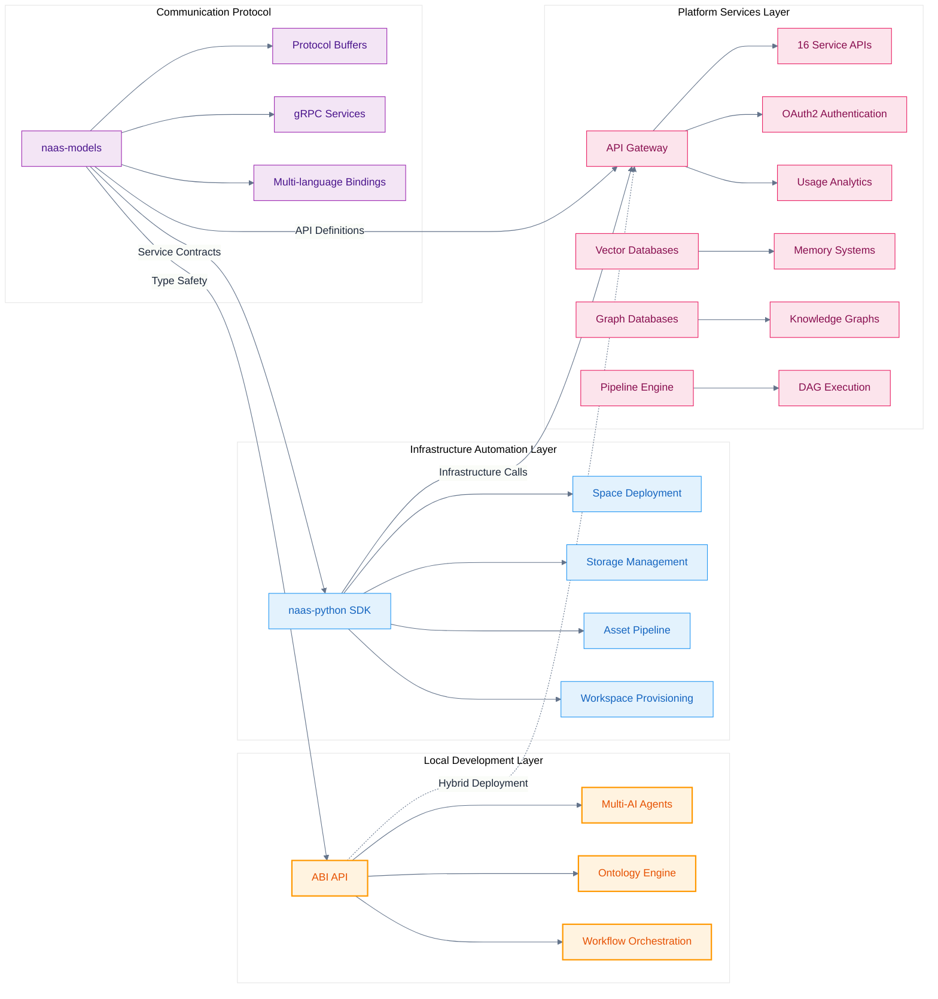

# Scaling Naas for Enterprise

Naas scales from individual prototypes to enterprise-grade deployments that rival platforms like Palantir Foundry. The platform's modular architecture supports everything from startup teams to Fortune 500 organizations and government agencies with the most stringent security requirements.

## Enterprise Positioning

**Naas provides enterprise-grade capabilities with open-source transparency.** Unlike proprietary platforms, Naas gives organizations complete control over their AI and data infrastructure while delivering the scale, security, and governance features expected in enterprise environments.

**Key enterprise differentiators:**
- **Open-source foundation** with commercial support options
- **Air-gapped deployment** capability for maximum security
- **Formal ontology standards** (W3C RDF/OWL) for semantic interoperability  
- **Multi-LLM architecture** avoiding vendor lock-in
- **Kubernetes-native** scaling and high availability

## Scaling Philosophy

Naas adopts a **hybrid scaling model** that recognizes the reality of modern AI development: you need both local control for rapid iteration and cloud infrastructure for production scale. Rather than forcing you to choose between local development or cloud deployment, the platform bridges both worlds seamlessly.

The key insight is that scaling isn't just about handling more traffic or data, it's about scaling your **development and iteration velocity**, **operational complexity**, and **team collaboration**. Each component in the Naas ecosystem is designed to reduce friction at different stages of your scaling journey.

## Three Pillars of Scale

### 1. Local AI Orchestration

Your scaling journey begins locally with the **[ABI API](/scale/api-integration/abi-api)**, which provides a complete AI operating system that runs on your machine. The ABI API functions as a production-capable system that handles multi-agent orchestration, ontology management, and complex workflow automation, delivering enterprise-grade capabilities from day one.

The power of starting locally means you can iterate rapidly without cloud costs, test complex agent interactions in controlled environments, and maintain full visibility into your AI system's behavior. When you're ready to scale, the same patterns and APIs translate directly to cloud deployment.

### 2. Cloud Infrastructure Automation

The **[naas-python SDK](/scale/client-sdks/python)** serves as your infrastructure automation layer, built on hexagonal architecture principles for maximum flexibility. This SDK implements infrastructure-as-code patterns that make scaling predictable and repeatable while providing complete control over cloud resource provisioning.

Whether you're provisioning storage buckets, deploying containerized applications to Spaces, or managing multi-user workspaces, the SDK abstracts complexity while maintaining full control. The hexagonal architecture means you can adapt the SDK to your specific infrastructure patterns without being locked into rigid workflows.

### 3. Platform Service Integration

The **[API Gateway](/scale/api-integration/api-gateway)** provides 16 comprehensive service APIs that handle every aspect of production scale: from serverless application deployment and vector databases to secure credential management and comprehensive observability.

These aren't just utility APIs, they're designed as building blocks for complex systems. The Chat API can orchestrate multiple AI models, the Pipeline API handles DAG-based workflows with resource optimization, and the Workspace API provides enterprise-grade multi-tenancy with granular permissions.

## Architecture Overview

## Scaling Strategies by Use Case

### Individual Developers: Rapid Prototyping to Production

As an individual developer, your scaling path focuses on **velocity and simplicity**. Start with the ABI API running locally to prototype AI agents and workflows without any cloud dependencies or costs. This local-first approach lets you experiment freely, test complex multi-agent interactions, and validate your business logic before committing to cloud resources.

When you're ready to share your work or need persistent storage, the naas-python SDK provides a natural bridge to cloud infrastructure. You can deploy your local workflows to Spaces for public access, store datasets in Object Storage, and share results through the Asset API, all while maintaining the same development patterns you used locally.

### Small Teams: Collaboration at Scale

Small teams face the challenge of maintaining development velocity while introducing collaboration and shared resources. The Workspace API becomes your central coordination point, providing multi-user access with role-based permissions that scale from 2-3 developers to larger teams.

The Chat API enables collaborative AI interactions where team members can share context, build on each other's work, and maintain conversation history across projects. Combined with the Asset API for sharing datasets and results, teams can maintain the rapid iteration of individual development while adding the structure needed for collaboration.

### Enterprise Organizations: Production-Grade Infrastructure

Enterprise scaling demands **reliability, observability, and governance**. The full API Gateway integration provides enterprise-grade capabilities: Pipeline API for complex workflow orchestration, Graph Database for organizational knowledge management, and comprehensive audit trails through the Event API.

The key enterprise insight is using Vector Databases for organizational memory, every chat, document, and analysis becomes part of a searchable knowledge base that improves over time. This transforms AI from individual tools into organizational intelligence that scales with your team's collective knowledge.

## Technical Integration Patterns

### Progressive Enhancement Architecture

The Naas platform is designed for **progressive enhancement**, each layer adds capabilities without requiring you to rebuild existing work. Start with local ABI development, enhance with SDK automation, and scale with platform services. Your code patterns remain consistent across all scaling levels.

### Protocol-Driven Development

The [naas-models](https://github.com/jupyter-naas/naas-models) repository provides the type-safe foundation that makes scaling reliable. Protocol Buffers ensure that your local development, SDK automation, and platform integrations all speak the same language with compile-time guarantees.

This isn't just about avoiding runtime errors, it's about **scaling confidence**. When you can trust that your local AI agent workflows will behave identically in production, scaling becomes a deployment decision rather than a reimplementation project.

## Implementation Roadmap

### Phase 1: Local Mastery (Week 1-2)
Clone the [ABI repository](https://github.com/jupyter-naas/abi), set up your local environment, and build your first multi-agent workflow. Focus on understanding the ontology system and workflow patterns that will scale.

### Phase 2: Infrastructure Integration (Week 3-4)  
Install the naas-python SDK and connect your local development to cloud infrastructure. Deploy your first Space, set up Object Storage, and begin using the Asset API for sharing.

### Phase 3: Platform Scaling (Month 2+)
Integrate with the full API Gateway for production requirements. Implement Pipeline workflows, set up Vector Databases for memory, and establish comprehensive monitoring through the Event API.

This phased approach ensures you're always building on solid foundations while progressively adding the capabilities needed for your specific scaling requirements.

## Enterprise Scaling Resources

### Technical Implementation
- **[Multi-Agent Systems](/scale/architecture/multi-agent-systems)**: Deep-dive into LangGraph-based agent architecture
- **[API Integration](/scale/api-integration/)**: Complete API reference and integration patterns
- **[Client SDKs](/scale/client-sdks/)**: Multi-language SDKs for platform automation

### Enterprise Deployment
- **[Enterprise Deployment](/scale/enterprise-deployment/)**: Security, compliance, and production deployment guides
- **[Platform Selection Guide](/scale/platform-comparisons/)**: Comprehensive guide for selecting the right AI platform for your organization

### Development Resources
- **[jupyter-naas/abi](https://github.com/jupyter-naas/abi)**: Local AI agent orchestration system
- **[jupyter-naas/naas-python](https://github.com/jupyter-naas/naas-python)**: Infrastructure management SDK  
- **[jupyter-naas/naas-models](https://github.com/jupyter-naas/naas-models)**: Protocol buffer definitions

## Getting Started

### For Individual Developers
1. **Local Development**: Clone [ABI repository](https://github.com/jupyter-naas/abi) and run `make api`
2. **Cloud Integration**: Install `pip install naas-python` and configure workspace
3. **Platform APIs**: Get API key from [naas.ai](https://naas.ai) and explore [API Gateway](https://api.naas.ai/redoc)

### For Enterprise Teams
1. **Enterprise Assessment**: Review [deployment options](/scale/enterprise-deployment/) and security requirements
2. **Competitive Analysis**: Compare with [existing platforms](/scale/vs-competitors/palantir-foundry) for migration planning
3. **Architecture Planning**: Study [multi-agent systems](/scale/architecture/multi-agent-systems) for technical implementation

Start your scaling journey with the [naas-python SDK](/scale/client-sdks/python) or [ABI API](/scale/api-integration/abi-api) for AI orchestration.
