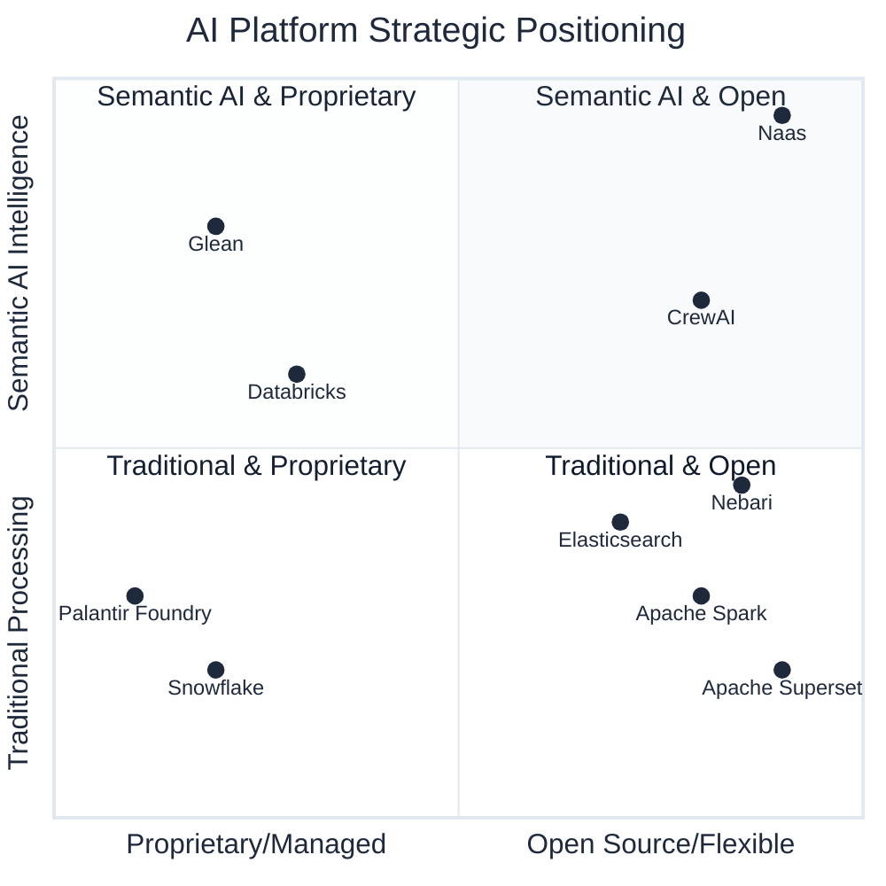

# Evaluation Framework

Organizations evaluating AI platforms need to understand both competitive positioning and integration opportunities. Naas can serve as either a standalone AI-native platform or as an intelligent layer that enhances existing data infrastructure.

This guide provides:
- **Head-to-head comparisons** between platforms for specific capabilities
- **Integration strategies** for building best-of-breed solutions
- **Migration guidance** from existing platforms to AI-native approaches
- **Decision frameworks** for choosing the right platform strategy

## Platform Positioning Overview

The following quadrant chart positions major AI and data platforms based on their architectural approach and intelligence capabilities:



### Strategic Quadrant Analysis

#### **Quadrant 1: Semantic AI Intelligence & Open Architecture** 
- **Naas**: Advanced semantic reasoning with W3C standards, multi-LLM orchestration, full deployment flexibility
- **CrewAI**: Multi-agent workflows with open-source framework and flexible deployment

#### **Quadrant 2: Semantic AI Intelligence & Proprietary Systems**
- **Glean**: AI-powered enterprise search with proprietary knowledge graph and managed service
- **Databricks**: ML platform with some AI capabilities but primarily managed cloud service

#### **Quadrant 3: Traditional Processing & Proprietary Systems**
- **Snowflake**: Cloud data warehouse with traditional SQL processing, managed service model
- **Palantir Foundry**: Enterprise data integration with proprietary modeling, closed ecosystem

#### **Quadrant 4: Traditional Processing & Open Architecture**
- **Apache Spark**: Distributed computing framework for large-scale data processing and analytics
- **Elasticsearch**: Search and analytics engine for structured and unstructured data
- **Apache Superset**: Business intelligence web application for data visualization and exploration
- **Nebari**: Open-source data science platform with GitOps approach and Dask-powered scaling

## Integration Patterns

### Layered Platform Approaches
**Proprietary Stack**: Palantir Foundry builds on top of Databricks infrastructure  
**Open-Source Stack**: Naas and Nebari work as complementary sister platforms

**Key Difference**: 
- Palantir → Databricks: Dependency relationship (Foundry needs Databricks)
- Naas ↔ Nebari: Partnership relationship (both platforms enhance each other)

**Benefits**: Complete open-source alternative with semantic AI capabilities

## Platform Strategies

### Option 1: Standalone AI-Native Platform
**When to choose**: Starting fresh, AI-first strategy, full control over architecture

**Naas as Primary Platform**:
- Complete AI-native data and analytics platform
- Conversational interfaces for all data interactions
- Semantic data modeling with formal ontologies
- Multi-agent orchestration across all workflows

### Option 2: Hybrid Platform Integration
**When to choose**: Existing platform investments, gradual AI adoption, best-of-breed approach

**Common Integration Patterns**:

#### **Data Warehouse + AI Layer**
```
Business Users ↔ Naas AI Agents ↔ Snowflake/BigQuery/Redshift
```
- **Compete**: Naas semantic modeling vs. relational schemas
- **Integrate**: Naas conversational interface to existing data warehouse
- **Best for**: Adding AI to established BI workflows

#### **ML Platform + AI Deployment**
```
Data Scientists ↔ Databricks/SageMaker ↔ Naas Agents ↔ Business Users
```
- **Compete**: Naas multi-agent workflows vs. notebook-based development
- **Integrate**: Naas agents deploy Databricks models conversationally
- **Best for**: Democratizing access to ML capabilities

#### **Enterprise Platform + AI Enhancement**
```
Analysts ↔ Palantir/Foundry ↔ Naas Agents ↔ Automated Workflows
```
- **Compete**: Naas open standards vs. proprietary integration platforms
- **Integrate**: Naas AI layer on top of Foundry data integration
- **Best for**: Adding AI flexibility to enterprise platforms

## Platform Categories

### AI-Native Platforms
**Philosophy**: AI and intelligence built into the core architecture from day one.

**Characteristics**:
- Multi-agent systems and AI orchestration
- Semantic reasoning and ontology-driven data modeling
- Native LLM integration across multiple providers
- Conversational interfaces as primary interaction method

**Best for**: Organizations building AI-first workflows, custom AI assistants, and intelligent automation systems.

**Example**: Naas represents this category with its ontology-powered AI agents and multi-LLM architecture.

### Traditional Data Platforms
**Philosophy**: Data warehousing and analytics with AI capabilities added as extensions.

**Characteristics**:
- SQL-centric data processing and transformation
- BI dashboards and reporting as primary outputs
- AI/ML features as add-on modules or separate services
- Structured data and traditional analytics workflows

**Best for**: Organizations with established data teams, heavy SQL usage, and traditional BI requirements.

**Examples**: Snowflake, Databricks, and similar cloud data platforms fall into this category.

### Enterprise Integration Platforms
**Philosophy**: Comprehensive data integration and workflow orchestration for large organizations.

**Characteristics**:
- Proprietary data modeling and transformation engines
- Enterprise-grade security and compliance features
- Custom application development capabilities
- Closed-ecosystem approach with vendor-specific tools

**Best for**: Large enterprises with complex integration needs, regulatory requirements, and dedicated platform teams.

**Examples**: Platforms like Palantir Foundry represent this approach.

## Key Decision Factors

### Architecture Philosophy

#### Open vs. Proprietary
- **Open-source foundations** provide transparency, customization, and avoid vendor lock-in
- **Proprietary platforms** offer integrated experiences but limit flexibility and visibility

#### Modular vs. Monolithic
- **Modular architectures** allow best-of-breed tool selection and gradual adoption
- **Monolithic platforms** provide unified experiences but require full platform commitment

#### AI Integration Approach
- **AI-native platforms** treat intelligence as a core capability across all functions
- **AI-enhanced platforms** add machine learning features to existing data workflows

### Deployment Flexibility

#### Cloud Strategy
- **Multi-cloud support** enables vendor diversification and regulatory compliance
- **Single-cloud optimization** may offer better integration but creates dependencies

#### On-Premises Options
- **Air-gapped deployment** capability for security-sensitive organizations
- **Hybrid architectures** balance security needs with cloud scalability

#### Control and Customization
- **Full source code access** enables deep customization and security auditing
- **Managed services** reduce operational overhead but limit control

## Migration Considerations

### From Traditional BI Platforms
**Common scenario**: Organizations outgrowing dashboard-centric analytics and seeking AI-powered insights.

**Key considerations**:
- Data model migration from dimensional to semantic/ontological
- User training on conversational vs. dashboard interfaces
- Integration with existing reporting and compliance processes

### From Data Warehouse Architectures
**Common scenario**: Data teams seeking to add AI capabilities to existing analytical workflows.

**Key considerations**:
- ETL/ELT process evolution to support real-time AI interactions
- Schema design changes to support semantic reasoning
- Tool chain integration and developer workflow changes

### From Proprietary Enterprise Platforms
**Common scenario**: Organizations seeking more flexibility, transparency, or cost optimization.

**Key considerations**:
- Data export and migration strategies
- Custom application and workflow recreation
- Team retraining and change management
- Compliance and security requirement validation

## Evaluation Framework

### Technical Assessment
1. **Architecture Alignment**: Does the platform's approach match your technical strategy?
2. **Integration Complexity**: How easily does it connect with your existing systems?
3. **Scalability Path**: Can it grow with your organization's needs?
4. **Customization Depth**: How much can you adapt it to your specific requirements?

### Business Evaluation
1. **Total Cost of Ownership**: Include licensing, infrastructure, and operational costs
2. **Implementation Timeline**: Consider migration complexity and time-to-value
3. **Vendor Relationship**: Evaluate long-term partnership potential and support quality
4. **Risk Assessment**: Consider vendor lock-in, technology obsolescence, and compliance risks

### Organizational Fit
1. **Team Capabilities**: Match platform complexity to your team's technical skills
2. **Change Management**: Consider the cultural shift required for adoption
3. **Governance Requirements**: Ensure platform supports your compliance and security needs
4. **Innovation Goals**: Align platform capabilities with your AI and data strategy

## Next Steps

### Detailed Platform Comparisons
Each comparison follows a consistent framework covering competitive positioning and integration strategies:

- **[Naas vs. Palantir Foundry](./palantir-foundry)**: AI-native platform vs. enterprise integration - compete or integrate?
- **[Naas vs. Snowflake](./snowflake)**: Conversational AI vs. cloud data warehouse - replacement or enhancement?
- **[Naas vs. Databricks](./databricks)**: Multi-agent orchestration vs. unified analytics - standalone or complementary?
- **[Naas vs. CrewAI](./crewai)**: Semantic reasoning vs. workflow automation - framework choice or integration?
- **[Naas vs. Glean](./glean)**: Multi-agent intelligence vs. enterprise search - advanced AI or knowledge management?
- **[Naas vs. Nebari](./nebari)**: Conversational AI vs. data science platform - business interface or technical foundation?

#### Comparison Framework
Each platform comparison includes:
1. **Offering**: Core value propositions and platform capabilities
2. **Capabilities**: Technical features and functional strengths
3. **Positioning**: Market positioning and competitive differentiation
4. **Integration Approach**: How platforms can work together
5. **Migration Strategies**: Practical guidance for platform transitions
6. **Decision Framework**: Evaluation criteria for choosing or integrating
7. **Getting Started**: Quick start paths for each platform and integration scenarios

### Decision Support
- **[Requirements Assessment](./requirements-assessment)**: Framework for evaluating your specific needs
- **[Proof of Concept Guide](./poc-guide)**: How to validate platform fit before full commitment
- **[Implementation Planning](./implementation-planning)**: Best practices for successful platform adoption

The right platform choice depends on your organization's specific needs, technical capabilities, and strategic goals. Each category has strengths that align with different use cases and organizational contexts.
