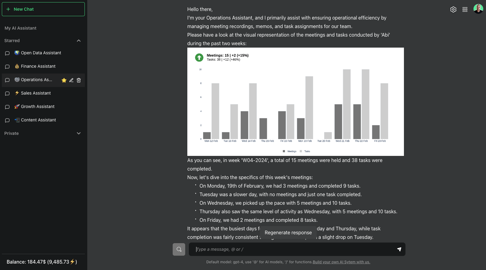

# ⚙️ Operations Efficiency
---

## Purpose
Automate and optimize operational tasks and conversations management, ensuring enhanced efficiency and streamlined workflows.

## Scope
- Extract minutes of meetings from Google Meet meetings
- Create email draft of minutes of meetings using Zapier
- Create list of tasks from recordings
- Track time spent on tasks using Clockify

## Responsibilities
- **Chief Operation Officer (COO):** Monitor operational efficiency.
- **Sales Teams:** Enhance response time to potential customers.
- **Customer Success:** Increase response speed to existing customers.
- **Data Analysts:** Analyze data to provide insights for improving operations efficiency.

## Metrics
- **On-Time Meeting Starts:** This metric is crucial to ensure punctuality and respect for everyone's time. It can be measured by the percentage of meetings that start exactly at their scheduled time.
- **Task Operational Efficiency:** This measures the accuracy of task time estimates against the actual time taken to complete them. A higher percentage indicates better estimation skills and operational efficiency.
- **Conversation Management Efficiency:** This could be measured by the average response time to emails or messages (staled conversations), the number of resolved issues, or customer satisfaction scores from communication.
- **Asset Utilization:** This metric shows how well assets are being used. It can be calculated as the number of hits on the asset links.
- **Time Entry Accuracy:** This measures the correctness of time entries in the timesheet. It can be improved by regular audits and employee training.

## Inputs
- **File management:** Google Drive (default)
- **Meeting recording:** Saved recordings to Google Drive from Google Meet (default)
- **Timesheet Management:** Clockify (default)

## Outputs
- **CONVERSATIONS:** Aggregates all kind of conversations (Emails, Social media messages, meeting recordings)
- **TASKS:** Organizes operational tasks for execution, sourced from the conversations.
- **TIMESHEETS:** Records all the time entry by tasks
- **ASSETS:** Collect all the assets created by humans or generated by assistants.
- **Operations Assistant Report:** Use the tables to calculate metrics and generate assets like charts and files for ad-hoc analytics (csv, png, html).
- **Operations Assistant Plugin:** Use the report assets and integrate them into the chat and the search engine for end-user consumption.

## Workflows
### Conversation Management
- **Aggregation:** Collect all conversations, including emails, social media messages, and meeting recordings. Store and organize them in the CONVERSATIONS table.
- **Response:** Ensure timely response to all conversations to maintain Conversation Management Efficiency. This includes follow-ups on meeting action items.

### Task Distribution
- **Task Assignment:** Assign tasks based on conversations, detailing them in the TASKS table with deadlines and responsible parties. Estimate task completion time to measure Task Operational Efficiency.
- **Follow-ups:** Monitor task completion and conduct regular follow-ups to ensure timely execution.

### Timesheet Management
- **Time Entry:** Record all time entries by tasks in Clockify.
- **Accuracy Check:** Conduct regular audits and provide employee training to ensure Time Entry Accuracy.

### Asset Management
- **Collection:** Gather all assets created by humans or generated by assistants from tasks. Store them in the ASSETS table.
- **Utilization:** Regularly update and check the usage of assets to maintain the Asset Utilization metric.

### Data Analysis and Optimization
- **Performance Tracking:** Review the bar chart data to track the number of meetings and tasks completed weekly. Compare with past data to identify any significant changes or trends.
- **Efficiency Assessment:** Calculate key efficiency ratios such as tasks per meeting and average task completion time. Use these ratios to gauge productivity and identify areas for improvement.
- **Insight Integration:** Apply insights from the data to refine operational processes. If more conversations do not lead to an increase in task completion, consider restructuring meeting schedules to prioritize task execution.

## Customization
- Connect to GitHub
- Connect to Notion

## Roadmap
- (Future plans and enhancements to be added here)
