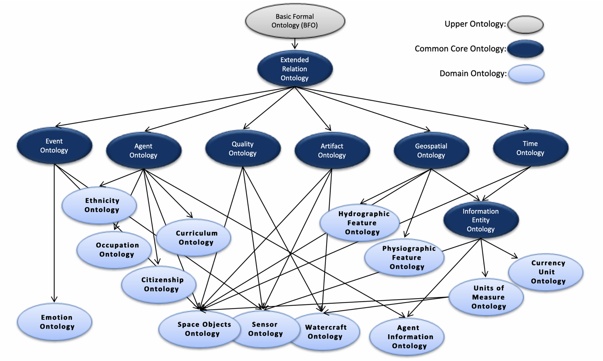

## What is CCO?

The Common Core Ontologies (CCO) is suite of eleven ontologies which, collectively, comprise a mid-level ontology. CCO - initiated by CUBRC, Inc. in 2010 under an IARPA Knowledge Discovery and Dissemination grant - is widely-used in defense and intelligence sectors to support data standardization, interoperability, reproducibility, and automated reasoning across numerous domains. Accordingly, CCO development and application was, for many years, conducted without much transparency. As of 2017, however, CCO has been available under a BSD-3 license with a public GitHub repository open to collaboration. Making CCO publicly available has led to significant increase of interest in CCO development. For example, in 2022 the Institute of Electrical and Electronics Engineers (IEEE) P3195 Standard for Requirements for a Mid-Level Ontology and Extensions working group initiated a review of CCO to become the first mid-level ontology standard. More recently, in 2024 CCO was endorsed as a “baseline standard” for all formal ontology development across the Department of Defense and Intelligence Community.

The Common Core Ontologies (CCO) are built on top of the Basic Formal Ontology (BFO) and provide a mid-level layer of ontological terms that bridge between BFO's top-level categories and domain-specific ontologies. This hierarchical relationship is illustrated in the diagram above, where CCO serves as an intermediary layer between BFO and various domain ontologies.

CCO consists of eleven ontologies:

1. **Action Ontology (AO)**: Defines types of actions, processes, and events
2. **Agent Ontology (AgO)**: Covers types of agents and their roles
3. **Artifact Ontology (ArO)**: Describes manufactured objects and their functions
4. **Event Ontology (EO)**: Specifies types of events and their temporal relationships
5. **Information Artifact Ontology (IAO)**: Defines information objects and their properties
6. **Military Ontology (MO)**: Covers military-specific concepts and relationships
7. **Organization Ontology (OO)**: Describes organizational structures and roles
8. **Plan Ontology (PO)**: Specifies plans, goals, and objectives
9. **Situation Ontology (SO)**: Defines situations and their components
10. **Time Ontology (TO)**: Covers temporal concepts and relationships
11. **Units of Measure Ontology (UO)**: Defines measurement units and quantities

Each of these ontologies extends BFO's top-level categories while providing more specific terms that can be used across multiple domains. This mid-level approach allows for:

- Standardized terminology across different domains
- Improved interoperability between systems
- Reduced redundancy in ontology development
- Consistent representation of common concepts
- Better support for automated reasoning

